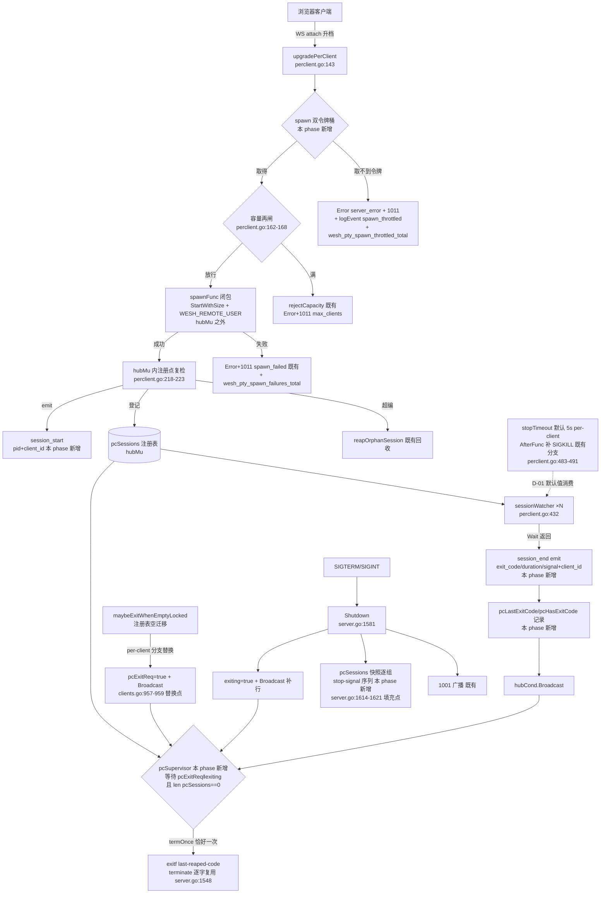

# Phase 13: resource-defense - Research

**Researched:** 2026-09-05
**Domain:** wesh 内部 Go 代码层加固——per-client 资源防线（spawn 双令牌桶）与终结语义（pcSupervisor 第二终结源 / Shutdown N 进程组 / 退出码对齐 / 观测面 per-client 粒度 / WESH_REMOTE_USER 注入）
**Confidence:** HIGH（全部结论锚定本会话逐行 Read 的一手源码 file:line + CONTEXT.md 已锁定裁决 D-01..D-10 + v1.1 设计蓝本 ARCHITECTURE.md/PITFALLS.md；唯一外部库面 golang.org/x/time/rate 经 GOMODCACHE 钉版源码核实）

<user_constraints>
## User Constraints (from CONTEXT.md)

### Locked Decisions

#### stop-timeout 默认值重议（公开契约变更，登记 Key Decisions）
- **D-01:** per-client 模式下 `--stop-timeout` **未显式设置时默认 5s**（非 0）——HUP 免疫泄漏防线默认开启（STATE.md Blockers ① 裁决落定；Phase 11 post-merge 已实证泄漏窗真实存在：bash 4.4 交互模式在「提示符 pselect + 竞态输入行待读」窗口内可无声吸收 SIGHUP）；shared 模式默认 0 逐字不变（v1.0 零回归红线）。机制 Phase 11 D-01 已就位（teardown 序列 `stopTimeout > 0` 则 AfterFunc 补 SIGKILL），本 phase 仅改默认值来源 — **Reversibility:** one-way — 公开契约变更
- **D-02:** 显式设置位区分「未设置」vs「显式 0」（fs.Visit 显式位 + TOML 键存在即置位，07-06 合并收尾先例同形态）；用户**显式 `--stop-timeout=0`（或 TOML 显式 `stop-timeout = "0s"`）+ per-client 时尊重用户意图**，validateStartup 经 warn 通道一行明示泄漏风险（--auth-header 暴露面警告先例；「不静默改写用户输入」纪律）

#### spawn 双令牌桶（churn 防线，PITFALLS P4 / PC-08 churn 语境操作化）
- **D-03:** 参数 = **内部常量：全局 8/s burst 16（防断网惊群）+ per-IP 1/s burst 4（防单点 churn）**；Options 覆写仅供测试注入（dwell 10s `defaultSlowDwell` 先例同构）；**不暴露 CLI flag/TOML 键**——零调优需求证据，公开契约面不膨胀；Phase 14 负载矩阵实测后如需调整，常量改值非公开契约变更
- **D-04:** 取不到令牌的拒绝 wire 形态 = **Error{server_error, 定值常量文案} + Close(1011)**——与容量再闸/spawn 失败同码同串（Phase 11 D-02「wire 聚合、日志细分」先例同构）；分辨率由 logEvent 事件名 `spawn_throttled` 承担；关闭码避开 1006 硬约束满足（前端仅对 1006 自动重连，Phase 6 shouldReconnect 裁决——1008/1011 均不在触发面，无重连放大循环）。否决 1008+spawn_throttled 新串：1008 受众 = 认证/版本策略违反，容量/节流策略混入污染受众分治；新机器串需动 proto 错误码表，协议零改动红线优先
- **D-05:** per-IP 桶键 = **XFF 换键**（--auth-header 信任闸开启时以 XFF 值作键，未开启用 TCP remote IP——throttleStore XFF 换键先例同闸采信）；不采信则反代部署下全部用户共享一桶，per-IP 1/s burst 4 形同虚设误伤合法多用户

#### 观测面四 OQ 逐项落地（OPS-12）
- **D-06:** OQ① healthz `session_active` per-client 语义 = **恒 true**（「会话服务可用」语义诚实——per-client 无「会话死亡=服务终结」态；编排探活只看 200/503 status 不受影响）；四字段键集红线不变；perclient_test.go:421 窗口期断言随之翻转
- **D-07:** OQ② `wesh_session_active` **同名 series 按模式分支取值**——shared = 0/1 探活语义（现状逐字不动），per-client = `len(pcSessions)` 活跃会话计数（快照内读）；HELP 文案按模式生成；否决另起 `wesh_sessions_active`
- **D-08:** 新计数器**四件全入**：`wesh_pty_spawn_total`（成功）/ `wesh_pty_spawn_failures_total` / `wesh_pty_kills_total`（SIGKILL 兜底次数）/ `wesh_pty_spawn_throttled_total`（节流拒绝——churn 防线「生效过」的唯一 metrics 面信号）；per-client-only 出数，shared 恒 0 series 保留不摘（credit_gate 恒 0 先例）；metricsSeries17 测试侧镜像一次性扩展 17→N（Phase 11 D-04 既定窗口）；零身份 label 红线扩到新 series
- **D-09:** 审计事件按研究 §7.1 schema：session_start（每次 spawn 成功 emit：pid + **client_id** + startedAt——pc.startedAt 字段 Phase 11 已预留本 phase 消费）/ session_end（watcher emit：同 shared schema exit_code/duration/signal + **client_id** 关联键；KILL 兜底经 signal 字段归因，不另起独立事件）；spawn_failed/spawn_throttled 走 logEvent 既有四段通道（remote/code/reason/remoteUser）；零敏感值红线（token/ticket/凭据永不入参）

#### pinger/dwell 竞态闭合（Phase 12-04 发现 → 本 phase 裁决）
- **D-10:** **接受 1006 语义**——「连 pong 都不回的真死/全停读连接被 pong_timeout 先杀（停读+5s~10s 窗口）」是正确收口；dwell 1013 面 = 回 pong 的活慢端（真实浏览器形态——浏览器网络栈自动回 pong 不受 JS 节流影响，该竞态对浏览器结构性不可达）；**不匹配 coder/websocket 库内部错误文案区分两类超时**（库升级改文案即失效的脆弱面）。phase12.mjs S6 的 `--ping-interval=0` 隔离 dwell 路径测试纪律固化为既定形态；README/CONFIGURATION 相应段明示该时序语义

#### 已锁定不重复决策（继承，下游直接执行）
容量三道闸与「并发子进程数 ≤ maxClients」硬不变量 Phase 11 已成立；teardown 固定序列恰好一次含 KILL 兜底分支（Phase 11 D-01）；spawn 失败/容量拒绝 wire 面 = Error{server_error} + 1011（Phase 11 D-02）；EXIT 直写纪律 / 唯一收割者 / Welcome 恒首帧 / exitf 恰好一次（termOnce 单点）四大不变量；零新依赖（x/time/rate 已在依赖）；零身份 label 红线；零回归双证据口径（shared 全量原样绿 + 期望值逐字未动，禁止断言放宽成「两模式都接受」）

### Claude's Discretion
- pcSupervisor 精确形态（hubCond 等 `(pcExitReq || exiting) && len(pcSessions) == 0`，研究 §4.1 参考实现；terminate/termOnce 逐字复用，「exitf 恰好一次、唯一收口」零漂移）
- maybeExitWhenEmptyLocked per-client 分支精确形态（`pcExitReq = true; hubCond.Broadcast()`；grace 0 立即/grace>0 宽限/宽限取消三形态复用同一计时器机械，研究 §4.3 表）
- Shutdown N 进程组快照逐组信号的有界 join 上界值与序列细节（研究 §4.4：pcSessions 快照逐组 stop-signal 序列 + exiting 置位 + hubCond.Broadcast() 补行；不等 D-state、不丢 session_end 事件）
- 退出码 last-reaped-code 规则实现（pcLastExitCode/pcHasExitCode 字段消费点；研究 §4.3 --once 两时序逐位对齐证明已备：子先死 exit 0 / 客户端先断 255）
- WESH_REMOTE_USER 注入接入点（whitelistEnv 白名单扩展 vs StartOptions.Env 通道扩展；键名固定 `WESH_REMOTE_USER`、值沿用 SEC-07 sanitize 清洗产物、仅 per-client 分支注入、spawn 时 env 组装一次到位；client.remoteUser 写一次字段既有）
- per-IP 桶存储形态（map + 惰性过期防无界增长，throttleStore 先例）
- WR-02 修复精确形态（waitDone 在 reap 完成点关闭 + teardown 快半段非阻塞 select——STATE.md 登记零成本严格修法）
- churn 压测精确断言与挂接（合法票据 10rps×30s；RSS/goroutine/fd 有界——wesh_goroutines/wesh_mem_alloc_bytes 既有观测钩子；load_test.go 扩展 vs phase13.mjs 场景的分配）
- phase13.mjs 协议层 UAT 场景集编号与断言颗粒度（建议面：churn 节流 1011+XFF 换键 / KILL 兜底默认 5s 生效（trap '' HUP 零配置）/ --once·exit-when-empty 三形态 per-client 退 255 / Shutdown N 组 pgid ESRCH + session_end 数=N / metrics 四计数器 + session_active 恒 true / WESH_REMOTE_USER env 可见）
- metricsSeries17 镜像测试扩展形态与 HELP 双模式文案断言
- 文档落点精确措辞（README/CONFIGURATION.md 默认值变更行 + 1006 先杀时序明示段——文档即被测物纪律）

### Deferred Ideas (OUT OF SCOPE)
- 令牌桶参数调优入口（flag/TOML 或常量改值）— Phase 14 负载矩阵后再评
- pinger 区分写阻塞/pong 超时 — D-10 接受 1006 语义
- session_killed 独立审计事件 — D-09 按 signal 字段归因
- 参数化测试 harness（newTestServer(t, mode)）与三维归类表 — Phase 14 既定
- 模式语义文档 PC-12 / herdr E2E UAT PC-13 / Playwright 浏览器层 / 负载矩阵标定回填 — Phase 14 既定范围
- per-client 默认 dwell 与 ping-interval 组合语义文档化 — 随 Phase 14 PC-12 一并落地
- 容量硬帽机制本体（Phase 11 已落地）；KILL 兜底机制本体（Phase 11 D-01 已就位，本 phase 仅改默认值）
</user_constraints>

<phase_requirements>
## Phase Requirements

| ID | Description | Research Support |
|----|-------------|------------------|
| PC-08 | per-client 模式下 `--max-clients` 兼任并发进程上限：握手 503 闸保留 + spawn 前 hubMu 内复检计数；并发子进程数 ≤ max-clients 为硬不变量 | 三道闸 Phase 11 已成立（perclient.go:162-168 pre-spawn 闸 + :218-223 注册点复检，本会话 Read 核实）；本 phase 增量 = spawn 双令牌桶（D-03/D-04/D-05，挂点 = :162 闸之前/同位）+ churn 负载测试（PITFALLS P4 验证形态） |
| PC-09 | `--once` / `--exit-when-empty` / 优雅关停语义适配：终结目标为全部存活 per-client 进程组各执行一遍 stop-signal 序列；注册表空迁移存在显式第二终结源 | 第二终结源 = pcSupervisor + pcExitReq（ARCHITECTURE §4.1/§4.3 参考实现与两时序逐位对齐证明）；Shutdown N 组快照挂点已核实为空 if 体（server.go:1614-1621）；早退守卫替换点 clients.go:957-959；退出码数据源 pc.exitCode 已预留（perclient.go:81-84） |
| SEC-09 | per-client 模式下 `--auth-header` 透传用户名注入子进程环境变量 `WESH_REMOTE_USER`（键名白名单固定、值沿用 SEC-07 sanitize）；shared 保持 D-15 收窄 | 注入宿主 = whitelistEnv（spawn.go:115-164，替换式注入纪律）；值源 = cl.remoteUser（写一次字段，perclient.go:227）；sanitize 产物 = proxy.go:136-141 remoteUser()（C0/C1/DEL 剥离 + 128 rune 截断）；传递链 = spawnFunc 闭包（main.go:1328-1333）→ StartWithSize |
| OPS-12 | /metrics 与审计日志 per-client 粒度：活跃会话数 gauge、spawn/kill 计数器、会话生命周期事件带 pid 归因；零身份 label 红线保持 | metrics 扩展点 = metrics.go:118-147 metricsHandler（17 series 现状）+ :52-58 metricsCounters + :87-110 snapshotMetrics；镜像锁 = metrics_test.go:40-58 metricsSeries17；审计挂点 = sessionWatcher（perclient.go:432）+ upgradePerClient 成功路径（:253 登记点之后）；healthz 分支点 = health.go:44 / server.go:550 |
</phase_requirements>

## Summary

Phase 13 是 v1.1 的防线收口 phase：Phase 11 已把 per-client 生命周期主干（spawn/断开 SIGHUP/EXIT 私有化/teardown 恰好一次/容量三道闸）全部落地，Phase 12 已把交互面（resize 直通/背压 dwell）落地；本 phase 的全部工作是在**既有机制骨架上**装配四道防线与语义对齐——① churn 防线（spawn 双令牌桶，x/time/rate 既有依赖零新增）；② HUP 免疫泄漏防线的默认开启（per-client stop-timeout 默认 0→5s，公开契约变更，D-01/D-02 显式位+warn 双形态）；③ 终结语义重建（pcSupervisor 第二终结源 + Shutdown N 进程组快照逐组信号 + last-reaped-code 退出码与 shared 逐位对齐）；④ 观测面 per-client 粒度（metrics 四计数器 + session_active 模式分支 + 审计 client_id 关联键）+ SEC-09 WESH_REMOTE_USER env 注入。

研究的总体判断：**本 phase 无新机制发明，全部是「既定先例的第 N 次同构应用」**——双令牌桶 = x/time/rate 输入限速器（perclient.go:236 在用）+ throttleStore per-IP 键管理（throttle.go）+ defaultSlowDwell 内部常量形态（12-03 D-03）三件先例的组合；pcSupervisor = hubCond 既有挂点 + termOnce/terminate 逐字复用；Shutdown N 组 = stopChildLocked（clients.go:1009-1014）每会话化；metrics 四计数器 = metricsCounters atomic 先例；审计事件 = emitEvent 既有通道。最大的工程风险不是「写错新代码」，而是**触碰 shared 路径造成零回归破坏**——全部改动必须锚定 per-client 分支，shared 列期望值逐字不动。

WR-02 修复（STATE.md 登记的零成本严格修法）经本会话源码核实确认窗口真实存在：sessionWatcher 在 `close(pc.waitDone)`（perclient.go:439）与 hubMu 内置 `reaped=true`（:442）之间存在微窗口，detach 路径的 teardown 快半段在该窗口内读 `pc.reaped==false` 会对已 reap 的 pgid 发信号。修法 = teardown 快半段对 `pc.waitDone` 做非阻塞 select（已关闭即视为 reaped 跳过信号）——结构性栅栏，零新同步件。

**Primary recommendation:** 按「防线装配序」切 plan：① D-01/D-02 stop-timeout 双默认值 + warn（main.go/config.go 纯装配层先行，零风险热身）→ ② spawn 双令牌桶 + spawn_throttled 计数器（churn 防线本体）→ ③ pcSupervisor/pcExitReq/last-reaped-code + Shutdown N 组（终结语义，PITFALLS P1 窗口期闭合）→ ④ 观测面（metrics 四计数器 + healthz/metrics 模式分支 + 审计事件）+ SEC-09 env 注入 → ⑤ churn 压测 + phase13.mjs + 收口闸。每片以「shared 全量测试原样绿 + 期望值逐字未动 diff 审查」为收口闸。

## Architectural Responsibility Map

| Capability | Primary Tier | Secondary Tier | Rationale |
|------------|-------------|----------------|-----------|
| spawn 节流（双令牌桶判定） | API/服务端（upgradePerClient pre-spawn 段） | — | fork 预算保护必须在 spawn 调用点之前；前端无角色 |
| churn 拒绝 wire 形态（Error+1011） | 服务端 → 客户端协议面 | 前端（1006-only 重连谓词不触发=被动受益） | D-04：1011 不在 shouldReconnect 触发集，闸自调节 |
| stop-timeout 双默认值 | CLI 装配层（cmd/wesh/main.go parse/validate） | 服务端（Options.StopTimeout 消费不变） | D-01：默认值来源在 main.go:244/314-320；服务端机制零改动 |
| HUP 免疫收割（KILL 兜底） | 服务端每会话 teardown（teardownPCLocked 既有分支） | — | 机制 Phase 11 已就位，本 phase 仅默认值消费 |
| 第二终结源（pcExitReq/pcSupervisor） | 服务端全局（New 钉死 goroutine） | — | exitf 唯一收口（termOnce）跨模式保持 |
| Shutdown N 进程组信号 | 服务端 Shutdown（server.go:1614 空 if 体填充点） | 每会话 watcher（收割+session_end emit） | 快照逐组信号在 Shutdown 函数体；join 有界不等 D-state |
| 退出码 last-reaped-code | 服务端（sessionWatcher 记录 + pcSupervisor 消费） | — | hubMu 保护字段（pcLastExitCode/pcHasExitCode 新增） |
| metrics per-client 粒度 | 服务端 /metrics handler（metrics.go） | — | 零身份 label 红线；snapshotMetrics 单趟 hubMu 快照形态扩展 |
| 审计 session_start/end + client_id | 服务端（emitEvent 通道） | — | log.go 既有单出口；挂点在 upgradePerClient/sessionWatcher |
| WESH_REMOTE_USER 注入 | pty 包 env 白名单（spawn.go whitelistEnv） | 服务端 attach 期值传递（cl.remoteUser） | SEC-06 替换式注入纪律所在层；值清洗在 proxy.go 提取点已完成 |
| churn 负载断言（RSS/goroutine/fd 有界） | 服务端测试层（load_test.go build tag / phase13.mjs） | /metrics 观测钩子（既有 series） | 断言通道归属测试层，产品代码零改动 |

## Standard Stack

**零新依赖是本 phase 的锁定约束**（CONTEXT 继承决策逐字：「零新依赖（x/time/rate 已在依赖——输入限速既有）」）。

### Core
| Library | Version | Purpose | Why Standard |
|---------|---------|---------|--------------|
| `golang.org/x/time/rate` | v0.15.0 [VERIFIED: go.mod 逐字 `golang.org/x/time v0.15.0`；GOMODCACHE `rate.go:100` `func NewLimiter(r Limit, b int) *Limiter`] | spawn 双令牌桶（全局 8/s burst 16 + per-IP 1/s burst 4，D-03） | 已在依赖且在热路径使用（perclient.go:236 `rate.NewLimiter(rate.Limit(s.inputRate), s.inputBurst)` 每客户端输入限速器）；令牌桶是 Go 生态标准答案 |
| Go stdlib `sync`/`sync/atomic`/`time` | go1.26.3 [VERIFIED: go.mod 逐字 `go 1.26.3`；本机 `go version go1.26.3 linux/amd64`] | pcSupervisor（hubCond）/ termOnce / AfterFunc KILL 兜底 / 计时器机械 | 全部既有件复用，零新同步原语 |
| `github.com/coder/websocket` | v1.8.15 [VERIFIED: go.mod] | Close(1011) 拒绝形态 | 既有协议库；`websocket.StatusInternalError` 常量在 perclient.go:136/185 两处已用 |

### Supporting
| Library | Version | Purpose | When to Use |
|---------|---------|---------|-------------|
| `log/slog` | stdlib | session_start/session_end/spawn_throttled 审计事件 | emitEvent/logEvent 既有通道（log.go:65-103）——禁止新日志出口 |

### Alternatives Considered
| Instead of | Could Use | Tradeoff |
|------------|-----------|----------|
| x/time/rate 令牌桶 | 自写计数窗（throttleStore 式 fails+notBefore） | throttleStore 是**认证失败退避**语义（递增窗口），churn 防线需要的是**稳态速率+突发容忍**语义；D-03 已锁令牌桶形态，且 rate 包已在依赖零新增成本 |
| 内部常量 + Options 覆写 | CLI flag/TOML 键暴露桶参数 | D-03 已锁不暴露——公开契约面不膨胀；Phase 14 实测后常量改值非公开契约变更 |

**Installation:** 无（零新依赖）。

**Version verification:** `go.mod` 本会话 Read 逐字核实四依赖：`github.com/coder/websocket v1.8.15` / `github.com/creack/pty v1.1.24` / `golang.org/x/sys v0.47.0` / `golang.org/x/time v0.15.0` / `github.com/pelletier/go-toml/v2 v2.4.3`。x/time/rate v0.15.0 API 面经 GOMODCACHE 钉版源码核实：`NewLimiter(r Limit, b int) *Limiter`（rate.go:100）、`Allow() bool`（:109）、`AllowN(t time.Time, n int) bool`（:116）、`Every(interval time.Duration) Limit`（:25）[VERIFIED: GOMODCACHE golang.org/x/time@v0.15.0/rate/rate.go:25-116]。

## Package Legitimacy Audit

**本 phase 零新装包**——Package Legitimacy Gate 的装包触发条件不成立。既有依赖 `golang.org/x/time v0.15.0` 为 Go 官方扩展库（golang.org/x 命名空间），go.mod 直接依赖且在产线热路径使用（perclient.go:236），GOMODCACHE 钉版源码本会话已读。

| Package | Registry | Age | Downloads | Source Repo | Verdict | Disposition |
|---------|----------|-----|-----------|-------------|---------|-------------|
| （无新包） | — | — | — | — | — | — |

**Packages removed due to [SLOP] verdict:** none
**Packages flagged as suspicious [SUS]:** none

## Architecture Patterns

### System Architecture Diagram



### Pattern 1: spawn 双令牌桶（内部常量 + Options 测试覆写）
**What:** upgradePerClient 的 pre-spawn 容量再闸（perclient.go:162-168）之前/同位插入两道令牌桶判定：全局桶（8/s burst 16，防断网惊群）+ per-IP 桶（1/s burst 4，防单点 churn）。取不到令牌即拒：Error{server_error, 定值常量文案} + Close(1011) + logEvent `spawn_throttled` + 计数器递增。
**When to use:** per-client 模式专属装配（shared 零 spawn 热路径，不装配——「装配期一次分岔」纪律）。
**Example:**

```go
// Source: 骨架自 ARCHITECTURE.md §3.1 时序 + perclient.go:162-187 既有闸形态推导；
// rate API [VERIFIED: GOMODCACHE golang.org/x/time@v0.15.0/rate/rate.go:100-116]
// D-03 内部常量（12-03 defaultSlowDwell 先例同构——常量 + Options 测试覆写，零 CLI/TOML 面）：
const (
	defaultSpawnGlobalRate  = 8  // 全局防惊群：8 spawn/s
	defaultSpawnGlobalBurst = 16
	defaultSpawnPerIPRate   = 1  // per-IP 防单点 churn：1 spawn/s
	defaultSpawnPerIPBurst  = 4
)

// per-IP 桶存储：map + 惰性过期防无界增长（throttleStore 先例同形态——
// throttle.go:36-41 mu+map 最小形态、recordFail 内 15min 惰性过期，无常驻 janitor）。
// 桶键 = D-05 XFF 换键：s.proxy.clientIP(r) 同源 [VERIFIED: proxy.go:89-103
// 「trust 且 XFF 头非空 → 链首 IP（ParseIP 校验）→ 回退 TCP 对端」]。
// 挂点 = upgradePerClient pre-spawn 段（:162 容量闸之前/同位）：
//   if !s.spawnGlobal.Allow() || !s.spawnPerIPAllow(ip) { 拒绝序列 }
// 拒绝序列与 rejectCapacity（perclient.go:133-137）同码同串不同事件名：
//   Error{server_error, 定值文案} → logEvent(remote, 1011, "spawn_throttled", remoteUser)
//   → Close(1011, server_error) → mc.spawnThrottled.Add(1)
```

**关键论证（D-04 本会话核实）**：1011 不在前端自动重连触发集——`web/src/main.ts:1023` 逐字 `case 1006: // CORE-05 触发谓词（D-01 显式判定——不是 default 桶）`，`web/src/lib/reconnect.test.ts:17` 逐字 `assert.equal(shouldReconnect(1006), true)` 且 :20 对 1000/1001/1008/1011/1013 全 false [VERIFIED: web/src/main.ts:1023, web/src/lib/reconnect.test.ts:16-20]。throttle 拒绝 → 前端停手，无重连放大循环。

### Pattern 2: pcSupervisor 单例（exitf 唯一收口的 per-client 同构映射）
**What:** New 的 per-client 分支（server.go:535-538，现状 `s.pcSessions = make(...)` 后即 return，零全局 goroutine）钉死唯一全局 goroutine pcSupervisor，经既有 hubCond（server.go:525 `s.hubCond = sync.NewCond(&s.hubMu)` [VERIFIED]）等待终结条件，收口走 termOnce/terminate 逐字复用（server.go:1548-1552 `func (s *Server) terminate(code int) { s.termOnce.Do(func() { s.exitf(code) }) }` [VERIFIED]）。
**When to use:** per-client 模式 New 装配期。
**Example:**

```go
// Source: [CITED: .planning/research/ARCHITECTURE.md §4.1 参考实现]，
// 字段名 pcExitReq/pcLastExitCode/pcHasExitCode 为该蓝本 §2.1 设计（Server 现状无此三字段——
// 本会话 grep 核实仅 pcSessions 存在于 server.go:192 [VERIFIED]，三字段本 phase 新增）。
func (s *Server) pcSupervisor() {
	s.hubMu.Lock()
	for !((s.pcExitReq || s.exiting) && len(s.pcSessions) == 0) {
		s.hubCond.Wait()
	}
	code := 0
	if s.pcHasExitCode {
		code = s.pcLastExitCode
	}
	s.hubMu.Unlock()
	s.terminate(code) // termOnce 单点——与 shared 同一收口件
}
```

**条件变量的两个等待谓词分量**：`pcExitReq`（exit-when-empty/--once 空迁移置位）与 `exiting`（Shutdown 置位，server.go:1592 hubMu 内置位 [VERIFIED]）；`len(s.pcSessions)==0` 由 sessionWatcher 收割链递减——现状 watcher 在 teardown 慢半段 `delete(s.pcSessions, pc)`（perclient.go:499 [VERIFIED]），本 phase 需在 watcher 收割点补 `hubCond.Broadcast()` 唤醒重估（蓝本 §4.1 序列）。

### Pattern 3: 注册表空迁移第二终结源（PITFALLS P1 闭合）
**What:** maybeExitWhenEmptyLocked 的 per-client 早退守卫（clients.go:957-959，现状逐字 `if s.sessionMode == SessionModePerClient { return }` [VERIFIED]）替换为：四守卫判定沿用（!exitWhenEmpty/exiting/非空/门闩）→ 触发时 `s.pcExitReq = true; s.hubCond.Broadcast()`（不发信号——末端断开已触发各会话 teardown SIGHUP，无需再发）。grace 0 立即 / grace>0 宽限 / 宽限取消三形态复用同一 exitEmptyTimer 机械（clients.go:970-997 既有 AfterFunc 三件套 [VERIFIED]）。
**退出码逐位对齐证明**（蓝本 §4.3，两时序）：子先死 exit 0 → watcher 收割 code=0 → pcExitReq → exitf(0)；客户端先断 → detach→teardown HUP→watcher 收割 -1 → exitf(-1) → 进程级 255（accept-255 裁决的 per-client 映射，emptyexit_test.go 头注释 OQ1 门 [VERIFIED: emptyexit_test.go:10-14]）。

### Pattern 4: Shutdown N 进程组快照逐组信号 + 有界 join
**What:** Shutdown 的 stop-signal 段模式守卫（server.go:1614-1621，现状 per-client 为**空 if 体** [VERIFIED: 本会话 Read 逐字 `if s.sessionMode == SessionModePerClient {` 空体 `} else { s.sess.SignalGroup(s.stopSignal) ... }`]）填充为：hubMu 内 pcSessions 快照 → 放锁 → 逐组执行 stop-signal 序列（SignalGroup(s.stopSignal) + stopTimeout>0 时 AfterFunc 补 SIGKILL——stopChildLocked clients.go:1009-1014 母本的每会话化）→ 有界 join（上界值属 Claude's Discretion，建议 = stopTimeout + 余量，蓝本 §4.4「不等 D-state、不丢 session_end」）。随后 `exiting=true`（既有置位点 :1592）+ `hubCond.Broadcast()` 补行唤醒 pcSupervisor。
**锁序红线**：快照在 hubMu 内取、信号在 hubMu 外发（Shutdown 现状即不在 hubMu 内发信号——server.go:1616 调用点在放锁后 [VERIFIED]）；各会话收割走 watcher 既有链，session_end 事件在 join 界限内正常 emit（D-09）。

### Pattern 5: 显式设置位 + warn 通道（D-01/D-02 stop-timeout 双默认值）
**What:** per-client 未显式设置 stop-timeout 时默认 5s；显式 0（CLI `--stop-timeout=0` 或 TOML `stop-timeout = "0s"`）尊重用户意图 + validateStartup warn 一行。
**机制基座（全部本会话核实）**：
- 默认值来源：`main.go:244` 逐字 `stopTimeoutDefault := time.Duration(0)` [VERIFIED]；TOML 合并 `:314-320`（`fc.StopTimeout != nil` → ParseDuration → 替换 default）[VERIFIED]；flag 注册 `:477` `fs.DurationVar(&cfg.stopTimeout, "stop-timeout", stopTimeoutDefault, ...)` [VERIFIED]
- 显式位先例：fs.Visit 块 `:536-567`（现状七位：write-policy/session-mode/max-clients/exit-when-empty/port/bind/socket-mode/socket-owner——**stop-timeout 尚无位，本 phase 新增第八位**）[VERIFIED]；配置键存在即置位先例 `:576-595`（fc.StopTimeout 需补入）
- warn 通道先例：validateStartup `:986` 返回 `(warn string, err error)`；modeWarns 累积形态 `:1006`（write-policy×per-client warn 逐字先例）[VERIFIED]；消费点 run() `:1285-1287` `fmt.Fprintln(os.Stderr, warn)` [VERIFIED]
- 双默认值落点：sessionMode 在 parse 期已知（sessionModeDefault 合并顺序 `:272-274`）——stop-timeout 默认值判定必须在 TOML 合并与 fs.Visit 之后（显式位在手才能区分「未设置」vs「显式 0」），run() 装配 Options 前落定终值

### Pattern 6: whitelistEnv 白名单扩展（SEC-09 WESH_REMOTE_USER 注入）
**What:** pty 包 whitelistEnv（spawn.go:115-164）增加可选注入键 `WESH_REMOTE_USER`——值 = cl.remoteUser（Attach 入口提取一次、此后只读的写一次字段，perclient.go:227 [VERIFIED]），提取点已经 sanitizeRemoteUser 清洗（proxy.go:136-141：C0/C1/DEL 剥离 + 128 rune 截断 [VERIFIED]）。
**两接入点（Claude's Discretion 二选一）**：
1. **whitelistEnv 参数扩展**：`whitelistEnv(term string, uid int)` → 加 `remoteUser string` 形参，空串不出键。替换式注入纪律（spawn.go:111 逐字「替换式注入——严禁把 os.Environ() 全量追加进来」）保持。
2. **StartOptions.Env 通道扩展**：StartOptions 加 `ExtraEnv []string`（或单键字段），StartWithSize 内 append 到白名单产物尾部。
**倾向建议**：选项 1（白名单扩展）——「键名白名单固定」语义由 pty 包单侧定义最诚实（SEC-06 防线就在该函数）；StartOptions 通道把「键名合法性」责任推给调用方，多一条误用面。两形态均需：仅 per-client 分支注入（spawnFunc 闭包扩展签名带 remoteUser——main.go:1328-1333 现状闭包签名为 `func(cols, rows int)` [VERIFIED]，扩展为捕获或传参）；shared 路径 whitelistEnv 调用点（spawn.go:81 `cmd.Env = whitelistEnv(opts.Term, opts.Uid)`）零漂移。

### Anti-Patterns to Avoid
- **hubMu 内 spawn 或 hubMu 横跨 spawn**（蓝本 Anti-Pattern 1）：双令牌桶判定是内存操作可放闸内，但 spawnFunc 调用必须保持 hubMu 之外（perclient.go:174 现状位置不动）。
- **复制节流存储第二份形态**：per-IP 桶若新写一套过期/淘汰机械即双写漂移面——throttleStore 的 mu+map+惰性过期形态直接同构（D-05/Discretion 已锚定先例）。
- **断言放宽成「两模式都接受」**：零回归双证据口径红线——shared 列期望值逐字未动，新行为全部走 per-client 分支断言。
- **metrics 新 series 带身份 label**：零身份 label 红线扩到新四 series——client_id/pid/remote 永不进 label（metrics.go:15-19 注释红线 [VERIFIED]）；per-client 明细一律查审计日志。
- ** Shutdown 内等待全部 Wait 无界返回**：PITFALLS P10——D-state 不可杀进程会拖死关停；有界 join 后无条件经 termOnce 退出。
- **为 pcSupervisor 新增 cond/锁类型**：hubCond 既有（server.go:525），「零新同步件」纪律。

## Don't Hand-Roll

| Problem | Don't Build | Use Instead | Why |
|---------|-------------|-------------|-----|
| spawn 速率限制 | 自写滑动窗口/计数器 | `rate.NewLimiter(rate.Limit(8), 16)` + `Allow()` [VERIFIED: GOMODCACHE rate.go:100-116] | 令牌桶边界语义（burst 填充节奏/零值行为）已被库正确实现；perclient.go:236 产线在用在测 |
| per-IP 键管理 | 常驻 janitor goroutine 清扫 | throttleStore 惰性过期形态（throttle.go:70-85 recordFail 内 `now.Sub(e.lastSeen) > 15*time.Minute` 重置）[VERIFIED] | 「零新 exitf 分支」纪律禁常驻 goroutine；56B/条 × 4096 IP ≈ 230KB 内存界论证既有 |
| XFF 桶键提取 | 新写 XFF 解析 | `s.proxy.clientIP(r)` 同源调用（proxy.go:89-103）[VERIFIED] | ParseIP 校验闸 + 回退语义 + 与 throttle/halfOpen 同键——再写一份即键分叉（同 IP 两配额） |
| 进程组信号序列 | 每会话新写信号逻辑 | teardownPCLocked 既有分支（perclient.go:481-491）/ stopChildLocked 母本（clients.go:1009-1014）[VERIFIED] | reaped 栅栏 + ESRCH 幂等 + AfterFunc 形态全部已论证；新写即 Pitfall 2 kill-after-reap 面重开 |
| 退出码收口 | 新 exitf 触发源 | termOnce/terminate 逐字复用（server.go:1548-1552）[VERIFIED] | 「exitf 恰好一次、唯一收口」硬约束跨模式保持（蓝本 Pattern 4） |
| WS 关闭码 | 魔数 1011 | `websocket.StatusInternalError`（perclient.go:136/185 既有用法）[VERIFIED] | 合规码集常量纪律 |
| remote_user 清洗 | 新 sanitize | `sanitizeRemoteUser` 提取点已清洗产物直接消费（proxy.go:55-67/136-141）[VERIFIED] | 单一写口纪律——清洗在提取点完成，下游零二次清洗 |
| Prometheus exposition | 引 prometheus/client_golang | writeGauge/writeCounter 既有三行组（metrics.go:152-158）[VERIFIED] | D-01 手写 exposition 是 v1.0 裁决（stdlib 哲学）；新 series 只需三行调用 |

**Key insight:** 本 phase 全部问题在 v1.0/v1.1 已有「第一个正确实现」——研究的价值不在找新方案，而在**指认每件既有实现的确切位置与同构映射关系**，让 planner 的任务动作全部是「扩展点挂接」而非「新写机制」。

## Common Pitfalls

### Pitfall 1: 空即不死——第二终结源漏装宽限到期形态
**What goes wrong:** pcExitReq 只在 grace==0 立即分支置位，grace>0 宽限到期回调忘置位——`--exit-when-empty=30s` + per-client 永不退出。
**Why it happens:** maybeExitWhenEmptyLocked 三形态（立即/宽限到期/宽限取消）中取消形态绝不置位，到期形态在 AfterFunc 回调内——分支替换时只改立即分支是最直觉的错误。
**How to avoid:** 三形态分支表（蓝本 §4.3）逐行对照：立即形态迁移点置位；宽限到期回调内（身份比对+复查通过后）置位；取消点零改动。UAT 三形态全测（PITFALLS 验证清单 :342「宽限到期」明示）。
**Warning signs:** phase13.mjs 只有立即形态用例。

### Pitfall 2: churn 防线误伤——per-IP 桶键不回退 XFF
**What goes wrong:** 反代部署下全部用户共享 TCP 对端键一桶，per-IP 1/s burst 4 把合法多用户的正常重连全节流。
**Why it happens:** 桶键直接用 RemoteAddr 而不走 clientIP XFF 换键。
**How to avoid:** D-05 已锁——桶键 = `s.proxy.clientIP(r)` 同源。测试面：proxy_e2e_test.go:121 TestXFFThrottleKey 是同形态先例（trust on/off 两态键行为）[VERIFIED: proxy_e2e_test.go:116-165]。
**Warning signs:** 反代 + 多浏览器场景 UAT 出现误拒。

### Pitfall 3: 节流拒绝误入 1006——前端重连放大 fork 循环
**What goes wrong:** 拒绝路径用库默认/abnormal 关闭（1006），前端 shouldReconnect 触发自动重连 → 每次重连再一次 spawn 尝试 → 节流面自我放大。
**Why it happens:** Close 码笔误或漏传码。
**How to avoid:** D-04 已锁 1011；前端谓词本会话核实仅 1006 触发（main.ts:1023）。断言面：phase13.mjs churn 场景断言 close code == 1011 逐值。
**Warning signs:** churn 测试期间 spawn 尝试计数 ≫ 注入速率。

### Pitfall 4: HUP 免疫泄漏默认值重议伤 shared——双默认值边界错位
**What goes wrong:** 把 main.go:244 的 `stopTimeoutDefault := time.Duration(0)` 直接改成 5s——shared 模式默认行为变更，v1.0 零回归红线破坏（「断开不退出、子进程继续运行」产品承诺的组成部分）。
**Why it happens:** D-01 的核心边界是「双默认值」而非「统一改默认」（CONTEXT specifics 逐字）。
**How to avoid:** 5s 只在 per-client 分支生效——判定 = sessionMode==per-client && !stopTimeoutSet（显式位第八位新增）→ 替换 default；shared 路径字面 0 逐字不动。显式 0 + per-client → 尊重 + warn（D-02）。diff 审查面：shared 列默认值断言逐字未动。
**Warning signs:** 既有 stopseq_test/shutdown_test shared 用例期望值被改动。

### Pitfall 5: WR-02 微窗口漏修——Wait-return→hubMu-acquire 间 reaped 误读
**What goes wrong:** sessionWatcher 现状序列：`pc.sess.Wait()` 返回（perclient.go:433）→ `close(pc.waitDone)`（:439）→ hubMu.Lock（:440）→ `pc.reaped = true`（:442）[VERIFIED]。detach 路径 teardown 快半段若在 waitDone 关闭后、hubMu 置位前的微窗口读 `pc.reaped==false`，对已 reap 的 pgid 发信号（kill-after-reap 理论面——实际不可达 = pid 回绕 + µs 窗，STATE.md 登记口径）。
**Why it happens:** reaped 置位在 hubMu 内，而 reap 完成（内核态）在 Wait 返回时——两个同步边不齐。
**How to avoid:** STATE.md 登记修法：teardown 快半段对 `pc.waitDone` 做非阻塞 select——已关闭即视为 reaped 跳过信号（结构性栅栏，零新同步件）。sessionWatcher 的 `close(pc.waitDone)` 已在 reap 完成点（:439），无需移动。
**Warning signs:** teardown 快半段只读 pc.reaped 不查 waitDone。

### Pitfall 6: Shutdown N 组漏「待收割残留者」
**What goes wrong:** Shutdown 只对 registry 客户端发 1001（detach 各自 SIGHUP 其会话），但「客户端已断开、会话 HUP 免疫待收割」的残留会话（pcSessions 在册、registry 无对应客户端）收不到信号——服务端退出后残留进程。
**Why it happens:** 1001 广播驱动 detach→teardown 链路覆盖不了无客户端会话。
**How to avoid:** 这正是 pcSessions 独立于 registry 存在的核心理由（蓝本 §4.4）——stop-signal 段快照源必须是 pcSessions（含待收割残留者），不是 registry。teardownOnce 幂等承接「1001 detach 已触发 teardown」与「Shutdown 快照再发信号」的双触发（perclient.go:474 `pc.teardownOnce.Do(...)` [VERIFIED]）。
**Warning signs:** Shutdown 测试只有「客户端在线」形态，缺「断开未收割」形态。

### Pitfall 7: churn 压测假绿——断言无判别力或瞬态 flake
**What goes wrong:** RSS/goroutine/fd 「有界」断言写成固定上限，CI 慢 runner 上基线漂移误报；或断言写成「不增长」但 GC 节律使单次采样随机过/不过。
**Why it happens:** Phase 9/11/12 教训：瞬态精确计数 flake（12-03 gateTransitions 差值取下界决策）、CI 慢 runner 时序（11-07 PS1 交错）。
**How to avoid:** 断言形态 = 起点/终点双采样 + 差值上界（goroutine 回落到基线 ±N）+ 多次轮询而非固定 sleep；合法票据 churn 10rps×30s（PITFALLS P4 既定形态）；观测钩子 = /metrics 黑盒 scrape（wesh_goroutines/wesh_mem_alloc_bytes 既有 series，metrics.go:141-144 [VERIFIED]）+ 进程 fd 计数（/proc/self/fd）。
**Warning signs:** 断言里出现单个硬编码绝对上限且无基线对照。

## Code Examples

以下骨架全部锚定本会话 Read 核实的一手源码；新增字段/常量名标注来源。

### 1. spawn 双令牌桶判定（upgradePerClient 插入段）

```go
// Source: 插入点与拒绝序列形态 [VERIFIED: internal/server/perclient.go:162-187 本会话 Read]
// rate API [VERIFIED: GOMODCACHE golang.org/x/time@v0.15.0/rate/rate.go:100-116]
// 桶键 [VERIFIED: internal/server/proxy.go:89-103 clientIP]
// 事件名 spawn_throttled、内部常量值 8/16/1/4 [CITED: 13-CONTEXT.md D-03/D-04]

// upgradePerClient 函数体首部（:162 容量闸之前/同位）：
//   throttleIP := s.proxy.clientIP(r) —— 注意：upgradePerClient 现状签名
//   (ctx, c, remote, remoteUser, h, ticketMode, cancel) 无 *http.Request ——
//   桶键需在 Attach 上游（请求在手处）提取后随参数传入，或签名扩展；
//   精确传参形态属实现细节，键来源纪律不变（D-05）。
if !s.spawnGlobalLimit.Allow() || !s.spawnPerIPAllow(throttleIP) {
	_ = c.Write(ctx, websocket.MessageBinary, proto.ErrorFrame(proto.ErrServerError, capacityMessage /* 或定值节流文案——D-04「同码同串」口径下与容量拒绝 wire 不可区分 */))
	logEvent(remote, websocket.StatusInternalError, "spawn_throttled", remoteUser)
	_ = c.Close(websocket.StatusInternalError, proto.ErrServerError)
	s.mc.spawnThrottled.Add(1) // D-08 四计数器之一
	return nil
}
```

### 2. pcSupervisor + 第二终结源触发端

```go
// Source: [CITED: .planning/research/ARCHITECTURE.md §4.1 参考实现]
// 触发端替换点 [VERIFIED: internal/server/clients.go:957-959 早退守卫现状逐字]
// termOnce/terminate [VERIFIED: internal/server/server.go:1548-1552]

// maybeExitWhenEmptyLocked per-client 分支（替换 :957-959 的 return 守卫）：
// 四守卫沿用（!exitWhenEmpty/exiting/非空/exitEmptySignaled），三形态：
//   grace==0 立即：s.pcExitReq = true; s.hubCond.Broadcast()（不发信号——
//     末端断开的 teardown 已 SIGHUP 其会话）
//   grace>0 宽限到期回调内（身份比对+复查通过后）：同两行动作
//   宽限取消：cancelExitEmptyTimerLocked 原样零改动
```

### 3. Shutdown N 进程组快照（server.go:1614-1621 填充）

```go
// Source: 填充点现状 [VERIFIED: internal/server/server.go:1614-1621 空 if 体]
// 每组执行母本 [VERIFIED: internal/server/clients.go:1009-1014 stopChildLocked]
// 序列细节 [CITED: .planning/research/ARCHITECTURE.md §4.4]
if s.sessionMode == SessionModePerClient {
	s.hubMu.Lock()
	pcs := make([]*pcSession, 0, len(s.pcSessions))
	for pc := range s.pcSessions {
		pcs = append(pcs, pc)
	}
	s.hubMu.Unlock()
	for _, pc := range pcs {
		pc.sess.SignalGroup(s.stopSignal) // reaped 栅栏由 teardownOnce/waitDone 面承接；
		// 精确栅栏形态（非阻塞 select waitDone）属 Claude's Discretion（WR-02 修法同构）
		if s.stopTimeout > 0 {
			time.AfterFunc(s.stopTimeout, func() { /* hubMu 内复检 !reaped → SIGKILL，perclient.go:484-491 同形态 */ })
		}
	}
	// 有界 join（上界 = stopTimeout + 余量，Claude's Discretion 定值）：
	// 轮询 len(pcSessions)==0 或等 hubCond + deadline——不等 D-state；
	// exiting=true + hubCond.Broadcast() 补行唤醒 pcSupervisor。
} else {
	s.sess.SignalGroup(s.stopSignal) // 现状逐字不动
	if s.stopTimeout > 0 {
		time.Sleep(s.stopTimeout)
		s.sess.SignalGroup(syscall.SIGKILL)
	}
}
```

### 4. session_start/session_end per-client emit（D-09）

```go
// Source: shared schema 母本 [VERIFIED: internal/server/server.go:1473-1483 逐字：
//   endAttrs := []slog.Attr{
//       slog.String("event", "session_end"),
//       slog.Int("exit_code", code),
//       slog.Float64("duration_seconds", time.Since(s.startedAt).Seconds()),
//   }
//   + 信号死亡经 exitSignalNum/signalName 出 signal 键]
// 数据源 [VERIFIED: perclient.go:80 pc.startedAt 预留注释「Phase 13 per-client
//   session_end duration_seconds 数据源预留」；:84 pc.exitCode]
// client_id 关联键 [VERIFIED: perclient.go:258-267 attach 事件 cl.attachSeq 同键先例]

// session_start：upgradePerClient 成功路径 pcSessions 登记（:253）后 emit——
//   emitEvent(slog.String("event", "session_start"),
//       slog.Int("pid", pc.sess.Cmd.Process.Pid),
//       slog.Int64("client_id", cl.attachSeq))
// session_end：sessionWatcher Wait 返回+退出码提取后（:433-438 区段）emit——
//   同 shared schema（exit_code/duration_seconds/time.Since(pc.startedAt)/signal 键）
//   + slog.Int64("client_id", cl.attachSeq)
// KILL 兜底归因：SignalGroup(SIGKILL) 死亡 → WaitStatus.Signaled → signal="KILL"——
//   经既有 exitSignalNum/signalName 链自然出键，不另起独立事件（D-09）
```

### 5. stop-timeout 双默认值 + 显式 0 warn（D-01/D-02）

```go
// Source: 全部挂点 [VERIFIED: cmd/wesh/main.go:244/314-320/477/536-567/576-595/986/1006]
// config 键 [VERIFIED: cmd/wesh/config.go:71 逐字
//   StopTimeout *string `toml:"stop-timeout"` // duration 串，合并期 time.ParseDuration 复用]

// parseArgs 内（fs.Visit 块 :536-567 新增第八位）：
//   if f.Name == "stop-timeout" { cfg.stopTimeoutSet = true }
// 配置显式位块（:576-595 追加）：
//   if fc.StopTimeout != nil { cfg.stopTimeoutSet = true }
// 终值落定（Options 装配前，sessionMode 与 stopTimeoutSet 均在手处）：
//   if cfg.sessionMode == server.SessionModePerClient && !cfg.stopTimeoutSet {
//       cfg.stopTimeout = 5 * time.Second // D-01：per-client 未显式设置默认 5s
//   }
// validateStartup 新增 warn（modeWarns 累积形态 :1006 先例同构）：
//   if per-client && cfg.stopTimeoutSet && cfg.stopTimeout == 0 {
//       modeWarns = append(modeWarns, "wesh: warning: --stop-timeout=0 with --session-mode=per-client; SIGHUP-immune processes (nohup/trap) will leak after client disconnect")
//   } // 文案精确措辞属 Claude's Discretion；warn 不含敏感值红线（main.go:985 注释）
```

### 6. metrics 四计数器 + session_active 模式分支（D-07/D-08）

```go
// Source: 扩展点 [VERIFIED: internal/server/metrics.go:52-58 metricsCounters /
//   :87-110 snapshotMetrics / :118-147 metricsHandler 17 series]
// 镜像锁 [VERIFIED: internal/server/metrics_test.go:40-58 metricsSeries17
//   逐字 17 条 name/typ 对 + :115-116 行数闸 3*len(metricsSeries17)]
// series 名四件 [CITED: 13-CONTEXT.md D-08 逐字]

// metricsCounters 追加四枚 atomic.Int64：
//   ptySpawn / ptySpawnFailures / ptyKills / ptySpawnThrottled
// 递增点：ptySpawn=upgradePerClient 登记成功（perclient.go:253 区段）；
//   ptySpawnFailures=spawn 失败分支（:183-186 既有 logEvent 同点）；
//   ptyKills=teardownPCLocked/reapOrphanSession 两 AfterFunc 补 KILL 实际发送点
//     （:488/:533——复检通过后、SignalGroup 之前）；
//   ptySpawnThrottled=节流拒绝点（本 phase 新增）。
// metricsHandler 尾部追加四条 writeCounter（17→21 series，镜像同步扩展）；
// session_active 分支（D-07）：
//   if s.sessionMode == SessionModePerClient {
//       sessionActive = int64(len from snapshotMetrics pcSessions 快照内读)
//   } else if s.sessionAlive.Load() { sessionActive = 1 } // shared 现状逐字
// HELP 文案按模式生成（metricsHandler 内 strings.Builder 组文案处分支）。
// shared 恒 0 出数不摘（credit_gate 恒 0 先例，蓝本 §7.2）。
```

### 7. healthz session_active 恒 true（D-06）

```go
// Source: 分支点 [VERIFIED: internal/server/health.go:44 逐字
//   SessionActive: s.sessionAlive.Load(),
//   四字段匿名 struct :35-45 键逐字 status/clients/max_clients/session_active]
// 最简形态二选一（Claude's Discretion）：① handler 内模式分支
//   `per-client → true`；② New per-client 分支（server.go:535-538）置
//   sessionAlive.Store(true)——per-client 下 lifecycle 不启动，:1487 的
//   Store(false) 永不到达，恒 true 语义成立且 handler 零分支。
// 断言翻转点 [VERIFIED: internal/server/perclient_test.go:420-422 现状断言
//   session_active==false + 注释「Phase 13 OQ①② 裁决落地时本断言随之翻转」]
```

## State of the Art

| Old Approach | Current Approach | When Changed | Impact |
|--------------|------------------|--------------|--------|
| per-client --once/--exit-when-empty 永不退出（D-04 已知中间态） | pcSupervisor/pcExitReq 第二终结源 | Phase 13（本 phase） | PITFALLS P1 窗口期闭合；perclient.go:28-32 头注释窗口期登记随之移除 |
| per-client stop-timeout 默认 0（继承 shared） | per-client 默认 5s（显式 0 尊重+warn） | Phase 13 D-01（one-way 公开契约变更） | HUP 免疫泄漏防线默认开启；README/CONFIGURATION 双文档行同步（docs/CONFIGURATION.md:77 与 :160 两处 `stop-timeout` 行 [VERIFIED: 本会话 grep]） |
| healthz session_active per-client 恒 false / wesh_session_active 恒 0（D-04 窗口期） | 恒 true / len(pcSessions) 计数 | Phase 13 D-06/D-07 | perclient_test.go:421 断言翻转；metricsSeries17 镜像 17→21 |
| dwell 1013 与 pong_timeout 1006 竞态未明示 | 接受 1006 先杀语义 + 文档明示 | Phase 13 D-10 | phase12.mjs S6 `--ping-interval=0` 隔离形态固化为既定测试纪律 |

**Deprecated/outdated:**
- 无（本 phase 不废弃任何既有面；D-01 是默认值变更非机制废弃）。

## Assumptions Log

| # | Claim | Section | Risk if Wrong |
|---|-------|---------|---------------|
| A1 | Shutdown 有界 join 上界建议值 = stopTimeout + 余量（蓝本 §4.4 方向，未定值） | Pattern 4 | LOW——Claude's Discretion 既定项；取保守值（如 stopTimeout+2s）即可，错配仅影响关停耗时上界 |
| A2 | per-IP 桶惰性过期窗口建议沿用 throttleStore 15min 量级 | Pattern 1 / Don't Hand-Roll | LOW——过期窗口只影响 map 内存界，不影响节流正确性；throttle.go:74 先例论证（15min > cap 一个数量级）可平移 |
| A3 | churn 压测 RSS/goroutine/fd 上界阈值需执行期基线标定（双采样差值形态） | Pitfall 7 | LOW——CONTEXT 已把精确断言列入 Claude's Discretion；阈值随 CI 机器基线浮动属预期 |
| A4 | upgradePerClient 现状签名无 *http.Request，XFF 桶键需在 Attach 上游提取传入（签名扩展或参数追加） | Code Example 1 | LOW——两种传参形态均不改变 D-05 键来源语义；planner 选型即可 |

**表外说明：** 上表四条均为「实现细节选型」级不确定项，非事实性假设；本研究全部事实性断言（file:line、常量值、schema、API 签名）均已 VERIFIED 或 CITED，无「可能记错」级风险项。

## Open Questions (RESOLVED)

1. **pcSessions 计数 gauge 的快照读取形态**
   - What we know: D-07 锁定「快照内读」；snapshotMetrics 现状单趟 hubMu 持有内填齐（metrics.go:87-110）
   - What's unclear: metricsSnap 是否新增 pcSessions 字段（顺手单趟读出）vs handler 内单独取锁——两形态锁序均安全
   - Recommendation: 新增 metricsSnap 字段（单趟纪律保持，避免第二趟 hubMu）
   - RESOLVED: 采纳 Recommendation，落点 13-05（must_haves.truths 第 4 条：metricsSnap 新字段单趟快照内读，绝不第二趟取锁）

2. **session_start emit 与 Welcome 入队的相对顺序**
   - What we know: shared 侧 session_start 在 goroutine 启动前 emit（server.go:546-547 注释「审计事件先于任何连接/会话流量落流」）
   - What's unclear: per-client 侧 emit 挂点在 pcSessions 登记后、startSessionGoroutines 前即可；与 attach 事件（:258-267）的先后序对检索无影响（client_id 同键关联）
   - Recommendation: 紧随 attach 事件之后、startSessionGoroutines 之前（:267-269 之间）——程序序保证事件先于会话流量
   - RESOLVED: 采纳 Recommendation，落点 13-05（must_haves.truths 第 7 条：session_start emit 挂点 :267-269 区间，per D-09）

3. **wesh_pty_kills_total 递增点的双路径覆盖**
   - What we know: 补 KILL 发送点有两处——teardownPCLocked AfterFunc（perclient.go:484-491）与 reapOrphanSession AfterFunc（:531-535）
   - What's unclear: 计数语义是否含孤儿回收路径
   - Recommendation: 两处都计（「SIGKILL 兜底次数」字面语义不区分路径；若 planner 认为孤儿路径应区分，事件名细分属 wire 聚合纪律外溢，不建议）
   - RESOLVED: 采纳 Recommendation，落点 13-05（must_haves.truths 第 8 条：ptyKills = teardownPCLocked :488 与 reapOrphanSession :533 两路径都计）

## Environment Availability

| Dependency | Required By | Available | Version | Fallback |
|------------|------------|-----------|---------|----------|
| Go 工具链 | 全部构建/测试 | ✓ | go1.26.3 linux/amd64（与 go.mod 逐字一致）[VERIFIED: `go version` 本会话执行] | — |
| Node.js | phase13.mjs 协议层 UAT | ✓ | v24.13.0（≥22 要求满足）[VERIFIED: `node --version` 本会话执行] | — |
| golang.org/x/time v0.15.0 | spawn 双令牌桶 | ✓ | go.mod 既有 + GOMODCACHE 在缓存 | — |
| darwin CI runner | 双平台编译闸/kqueue 面 | ✓（CI 侧，Phase 11/12 先例在跑） | — | — |
| Playwright/浏览器 | 无（Phase 14 范围） | — | — | 本 phase 不需要——CODEBUDDY.md 双机拓扑：Linux 侧禁装浏览器，协议层 UAT 零依赖脚本自足 |

**Missing dependencies with no fallback:** 无
**Missing dependencies with fallback:** 无

## Validation Architecture

### Test Framework
| Property | Value |
|----------|-------|
| Framework | Go stdlib testing + `-race`（go1.26.3），package server_test 外部包形态（全仓统一）；UAT = Node 原生 WebSocket/fetch 零依赖脚本（web/uat/phaseNN.mjs 先例）；负载 = build tag `load` 隔离（load_test.go:1-8）[VERIFIED] |
| Config file | 无——`//go:build load` 首行硬纪律为唯一隔离配置（load_test.go:1）[VERIFIED] |
| Quick run command | `go test ./internal/server/ -count=1`（单包快迭代） |
| Full suite command | `time go test -race ./...`（Phase 12 收口闸实测 5 包 1m21s）+ UAT 矩阵（phase02-12 既有脚本默认模式零修改重跑 + phase13.mjs 两轮） |

### Phase Requirements → Test Map
| Req ID | Behavior | Test Type | Automated Command | File Exists? |
|--------|----------|-----------|-------------------|-------------|
| PC-08 | 双令牌桶节流拒绝（1011/spawn_throttled/计数器）+ XFF 换键 | unit + 协议层 | `go test ./internal/server/ -run 'TestPerClientSpawnThrottle' -count=1`；`node web/uat/phase13.mjs` churn 场景 | ❌ Wave 0（Go 测名占位；phase13.mjs 新增） |
| PC-08 | churn 负载 RSS/goroutine/fd 有界（10rps×30s 合法票据） | load（build tag） | `go test -tags=load -run TestChurn -count=1 ./internal/server/` | ❌ Wave 0（load_test.go 扩展） |
| PC-09 | --once/exit-when-empty 三形态 per-client 退 255 + 注册表空迁移第二终结源 | unit + 进程级 | `go test ./internal/server/ -run 'TestPerClientExitWhenEmpty' -count=1`；phase13.mjs 三形态 | ❌ Wave 0（emptyexit_test.go 双模式断言分叉扩展——PITFALLS :386 归属表既定） |
| PC-09 | Shutdown N 进程组各一遍 stop-signal + 有界 join + session_end 数=N | unit | `go test ./internal/server/ -run 'TestPerClientShutdown' -count=1` | ❌ Wave 0（shutdown_test.go 扩展；夹具形态 startShutdownServerWith 先例 [VERIFIED: shutdown_test.go:17-19]） |
| PC-09 | 退出码两时序逐位对齐（子先死 exit 0 / 客户端先断 255） | unit + 进程级 | emptyexit/exit 测试组 per-client 断言分叉 | ❌ Wave 0 |
| SEC-09 | WESH_REMOTE_USER 注入（per-client 子进程 env 可见；shared 不注入） | unit + 协议层 | `go test ./internal/pty/ -run TestEnvWhitelist -count=1`（扩展）；phase13.mjs `env` 回读场景 | ❌ Wave 0（pty 包白名单测扩展 + UAT 场景） |
| OPS-12 | metrics 四计数器 + session_active 模式分支 + HELP 双模式文案 | unit | `go test ./internal/server/ -run 'TestMetrics' -count=1` | ❌ Wave 0（metricsSeries17 镜像 17→21 扩展） |
| OPS-12 | session_start/end 带 pid+client_id；spawn_failed 零敏感值 | unit | `go test ./internal/server/ -run 'TestPerClientSessionEvents' -count=1` | ❌ Wave 0（events_test.go schema 扩展 [VERIFIED: events_test.go:427-469 shared 断言母本]） |
| OPS-12 | healthz session_active per-client 恒 true | unit | 既有断言翻转点 perclient_test.go:420-422 | ✅（翻转既有断言，非新文件） |
| WR-02 | teardown 快半段 waitDone 非阻塞 select 栅栏 | unit（白盒竞态注入） | `go test ./internal/server/ -race -run 'TestPerClientReapedFence' -count=1` | ❌ Wave 0 |
| D-01/D-02 | per-client 默认 5s / 显式 0 尊重+warn / shared 默认 0 不变 | unit（main 包） | `go test ./cmd/wesh/ -run 'TestStopTimeout' -count=1` | ❌ Wave 0（cmd/wesh 配置/校验测试扩展） |

### Sampling Rate
- **Per task commit:** `go test ./internal/server/ -count=1`（触面包）+ `go test ./cmd/wesh/ -count=1`（D-01/D-02 触面时）
- **Per wave merge:** `time go test -race ./...` 全量
- **Phase gate:** 收口闸六段式（Phase 11-06/12-05 先例）：静态面（gofmt/vet）+ 全量 -race + darwin 双编译闸 + dist byte-identical + UAT 矩阵（既有脚本默认模式零修改重跑 + phase13.mjs 两轮）+ diff 白名单审查（shared 期望值逐字未动/零新依赖）

### Wave 0 Gaps
- [ ] `web/uat/phase13.mjs` — 协议层 UAT 六建议场景（churn 节流 1011+XFF / KILL 兜底 5s trap '' HUP / 退出三形态 255 / Shutdown N 组 ESRCH+session_end=N / metrics 四计数器+session_active / WESH_REMOTE_USER env 可见）；RawStallClient 夹具可复用（phase12.mjs 既定件）
- [ ] `internal/server/perclient_test.go` 扩展组 — 双桶单元测/第二终结源/Shutdown N 组/事件 schema/WR-02 栅栏
- [ ] `internal/server/emptyexit_test.go` / `shutdown_test.go` — per-client 断言分叉扩展（PITFALLS :386-387 归属表既定，禁止断言放宽）
- [ ] `internal/server/metrics_test.go` — metricsSeries17 → 21 镜像扩展 + HELP 双模式断言
- [ ] `internal/server/load_test.go` — churn 负载格（合法票据 10rps×30s，RSS/goroutine/fd 双采样差值断言）
- [ ] `cmd/wesh/` 测试 — stop-timeout 显式位/双默认值/warn 文案（config_test/main 测试组扩展点）
- [ ] `internal/pty/spawn_test.go` — whitelistEnv WESH_REMOTE_USER 扩展（TestEnvWhitelist 双模式同断言归属既定 [VERIFIED: PITFALLS :395]）

*(框架安装：无——测试基础设施全量既有，本 phase 全部为新测试文件/扩展形态)*

## Security Domain

`security_enforcement: true`、`security_asvs_level: 1`（config.json [VERIFIED]）。

### Applicable ASVS Categories

| ASVS Category | Applies | Standard Control |
|---------------|---------|-----------------|
| V2 Authentication | partial（反自动化面） | churn 防线 = 已认证滥用限速（spawn 双令牌桶）；认证失败节流既有（throttleStore）零改动 |
| V3 Session Management | no | — |
| V4 Access Control | no（ro/rw 门控既有零改动） | — |
| V5 Input Validation | yes | XFF 桶键复用 clientIP 的 ParseIP 校验闸（proxy.go:93）[VERIFIED]；WESH_REMOTE_USER 值复用 sanitizeRemoteUser 清洗（C0/C1/DEL 剥离 + 128 rune 截断）[VERIFIED: proxy.go:55-67]；metrics 新 series 零身份 label |
| V6 Cryptography | no | — |
| V7 Error Handling & Logging | yes | spawn_throttled/spawn_failed 事件零敏感值（定值常量文案，绝不携带 err.Error()/路径/errno——perclient.go:183 既有纪律延伸）；SEC-01 红线扩到新事件 |

### Known Threat Patterns for Go PTY-over-WebSocket per-client spawn

| Pattern | STRIDE | Standard Mitigation |
|---------|--------|---------------------|
| 已认证 churn fork bomb（合法票据 connect→spawn→disconnect 死循环） | Denial of Service | spawn 双令牌桶（D-03 全局 8/s burst 16 + per-IP 1/s burst 4）+ 1011 关闭避开重连放大（D-04） |
| 断网惊群（N 浏览器同时自动重连 = N 个 fork+exec） | Denial of Service | 全局桶 8/s 上限 + 前端退避既有（30s 封顶） |
| HUP 免疫进程泄漏 ×N（nohup/trap '' HUP 叠加 churn 绕开 maxClients 驻留无界） | Denial of Service | per-client stop-timeout 默认 5s KILL 兜底（D-01）；显式 0 尊重+warn（D-02） |
| kill-after-reap 误杀复用 pgid（宿主机无关进程组） | Tampering | reaped 栅栏 + WR-02 waitDone 非阻塞 select 结构性栅栏（Pitfall 5） |
| WESH_REMOTE_USER env 注入（键名/值注入子进程环境） | Elevation of Privilege / Tampering | 键名白名单固定（代码常量非配置）；值经 SEC-07 sanitize；shared 不注入（D-15 收窄不变） |
| metrics 身份 label（client_id/pid/remote 进 label） | Information Disclosure + 基数爆炸 DoS | 零身份 label 红线扩到新四 series；per-client 明细一律审计日志 |
| 审计事件敏感值（token/ticket/凭据入参） | Information Disclosure | logEvent/emitEvent 既有红线（log.go:85-89）延伸；spawn_failed 定值文案 |
| Shutdown 无界 join 被 D-state 进程拖死 | Denial of Service | 有界 join（stopTimeout+余量）后无条件 termOnce 退出 |

## Sources

### Primary (HIGH confidence)
- wesh 当前源码本会话逐行 Read（一手，全部 VERIFIED 标签的锚点）：`internal/server/perclient.go` 全 543 行（pcSession 字段集/upgradePerClient/sessionWatcher/teardownPCLocked/reapOrphanSession）、`internal/server/server.go` :460-555（New 模式分岔）:1452-1487（session_end/sessionAlive）:1548-1622（terminate/Shutdown）、`internal/server/clients.go` :880-1029（detach 挂点/maybeExitWhenEmptyLocked/stopChildLocked）、`internal/server/metrics.go` 全 177 行、`internal/server/health.go` 全 54 行、`internal/server/throttle.go` 全 108 行、`internal/server/proxy.go` 全 142 行、`internal/server/log.go` 全 103 行、`internal/pty/spawn.go` 全 164 行、`cmd/wesh/main.go` :240-330/:528-607/:986-1035/:1290-1400、`cmd/wesh/config.go:71`、`internal/server/metrics_test.go:30-130`、`internal/server/perclient_test.go:380-450`、`internal/server/load_test.go:1-80`、`internal/server/emptyexit_test.go:1-30`、`internal/server/shutdown_test.go:1-30`、`internal/server/export_test.go`（grep 函数清单）、`web/src/main.ts:1023`/`web/src/lib/reconnect.test.ts:16-20`（1006-only 谓词）、`go.mod` 全文、`docs/CONFIGURATION.md:77,160`（grep）
- GOMODCACHE `golang.org/x/time@v0.15.0/rate/rate.go:19-116`（NewLimiter/Allow/AllowN/Every API 面钉版核实）
- `.planning/phases/13-resource-defense/13-CONTEXT.md`（D-01..D-10 锁定裁决与 Discretion 边界，逐字抽取）
- `.planning/research/ARCHITECTURE.md` §2.1/§3.1/§4.1/§4.3/§4.4/§5/§7（设计蓝本——pcSupervisor 参考实现/两时序对齐证明/Shutdown 两处分支/锁序三规则/审计 metrics 双语义表）
- `.planning/research/PITFALLS.md` P1/P4/P8/P10 + 验证清单 + 既有测试双模式归属表（:378-399）
- `.planning/research/FEATURES.md` §T8/D4/D5（需求源头与裁决记录）
- `.planning/STATE.md` Blockers ①③/WR-02 登记/Phase 12-04 pinger/dwell 竞态发现

### Secondary (MEDIUM confidence)
- 无（本 phase 无需要二手来源佐证的断言）

### Tertiary (LOW confidence)
- 无

**外部检索说明：** 本 phase 全部问题为 wesh 内部代码层加固裁决（防线参数已锁 D-03、机制先例全部在仓、wire 形态已锁 D-04）——无生态系统选型类问题。config.json 中全部外部搜索 provider（brave/firecrawl/exa/tavily/ref/perplexity/jina）均 disabled；Context7 已尝试检索 golang.org/x/time（未收录，返回结果全为无关库）——x/time/rate API 面改经 GOMODCACHE 钉版源码核实（比文档更强的证据级：go.mod 钉住的确切版本）。

## Metadata

**Confidence breakdown:**
- Standard stack: HIGH——零新依赖；唯一库面 x/time/rate 经 GOMODCACHE 钉版核实 + 产线在用在测
- Architecture: HIGH——全部扩展点 file:line 本会话 Read 核实；pcSupervisor/第二终结源/Shutdown N 组有蓝本参考实现与对齐证明；WR-02 窗口经源码确认真实存在
- Pitfalls: HIGH——P1/P4/P8/P10 均有仓内机制锚点 + Phase 11/12 实测记录佐证（bash 4.4 HUP 吸收窗 2026-09-04 实证、12-04 pinger/dwell 竞态实测）

**Research date:** 2026-09-05
**Valid until:** 2026-10-05（内部代码研究，随 main 分支演进失效；外部依赖面仅 x/time/rate 钉版 v0.15.0 不失效）
