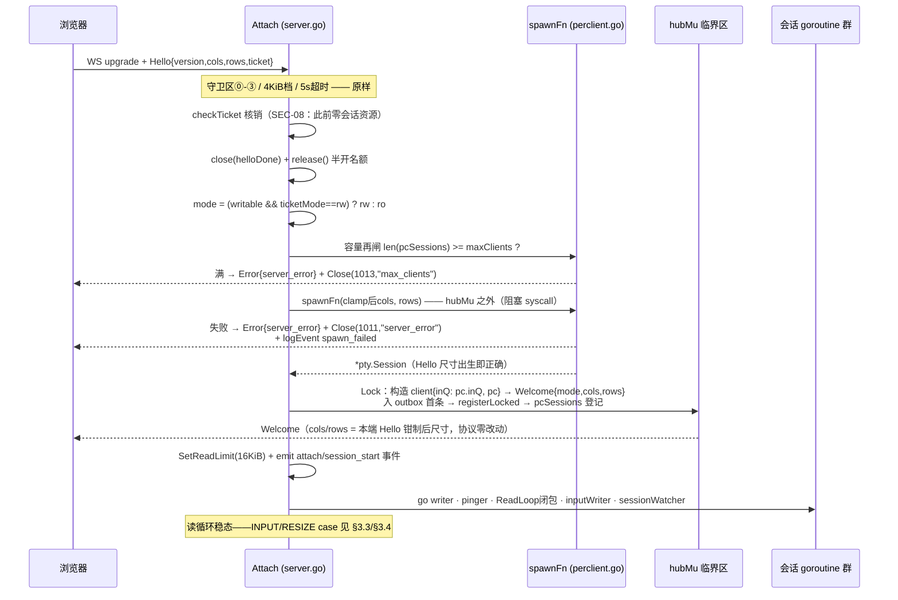

# Architecture Research — wesh v1.1 per-client 会话模式集成设计

**Domain:** Web 终端共享工具内部架构（Go 单二进制，PTY over WebSocket）
**Researched:** 2026-09-01
**Confidence:** HIGH（全部结论锚定 wesh 当前源码 file:line 实证 + v1.0 RESEARCH 已锁定的 ttyd per-connection 语义；本课题为内部集成设计，非生态系统调研——七个问题均为代码层裁决，外部检索无决策增量）

---

## 0. 先行结论（TL;DR）

per-client 模式的正确集成形态是**「装配期一次分岔，运行期零分岔」**：

1. **Server 结构**：保留 `sess *pty.Session`（shared 专用，零漂移），新增装配期固化三件套——`sessionMode`（不可变）、`spawnFn func(cols, rows int) (*pty.Session, error)`（会话工厂）、`pcSessions` 注册表（per-client 会话活性登记，hubMu 保护）。**不抽象 session 接口**——分支点仅 6 处且全部显式，接口泛化是过度设计（与 `proto.ValidClientOptionKey`「刻意直白 switch」同哲学）。
2. **spawn 点**：attach 升档序列内、**ticket 核销之后、Welcome 组帧之前、hubMu 之外**。预认证 spawn 违反 SEC-08 红线；spawn 失败发既有 `Error{server_error}` 帧 + 1011 关闭（协议零改动，`proto.ErrServerError` 常量已备而从未启用）。
3. **生命周期**：shared 的 `lifecycle()` 逐字不动；per-client 每会话一个 `sessionWatcher`（Wait → EXIT 私有化 → 关本端 WS）+ **一个 supervisor goroutine**（New 钉死）经既有 `termOnce/terminate` 单点收口 exitf——「exitf 唯一收口」纪律在新模式下的同构映射。
4. **代码复用**：给 `client` 加 `inQ *inputQ` 间接字段使读循环 INPUT case **逐行不分支**；`inputWriter` 改为参数化（1 份代码 N 实例）；outbox/writer/pinger/mergeBatch/kick 机械**零改动复用**（arbiter 空集时 kick 链路天然安全）。两模式共享面 ≥90% 成立。
5. **退出码规则**：`exitf(lastReapedExitCode)`——末次收割会话的退出码。--once 两模式下两种时序（先断后死 / 先死后断）均与 shared 逐位对齐（255 / 子进程码），证明见 §4.3。
6. **maxClients 语义升级**：per-client 下从「客户端计数闸」升级为**硬进程帽**——spawn 点再闸 `pcActive >= maxClients → 1013 max_clients`（除既有 ③位/早闸外的第三道，专为昂贵资源而设）。

---

## 1. 现状锚点（集成点，file:line 实证）

### 1.1 两模式共享、零改动的机制

| 机制 | 位置 | per-client 下的形态 |
|---|---|---|
| HTTP 路由树/认证链/share token/Origin/安全头 | `server.go:462-585` Handler() | 原样 |
| WS 守卫区 ⓪-③（Origin/子协议/半开/max-clients 503） | `server.go:749-798` | 原样（③位计数源 `registry.n`，per-client 同样注册） |
| Hello 状态机/ticket 核销/checkTicket | `server.go:851-892`, `1101-1124` | 原样（spawn 在其后，§2.2） |
| outbox + writer + pinger 三件套 | `clients.go:151-193`(outbox), `701-724`(writer), `server.go:1153-1192`(pinger) | **逐字复用**——per-client 客户端仍是 registry 成员 |
| 输入限速器（mode 门 ro 丢 + AllowN） | `server.go:1036-1056` | 原样（mode 判定逻辑简化，门不变） |
| kickSlowConsumerLocked 1013 踢出 | `clients.go:564-594` | 原样复用——arbiter 空集时 removeMember/recalcNow 天然 no-op（Go nil map delete 安全、arbitrate(0) 零值哨兵提前返回），owner 恒 nil 不触发 promote |
| EXIT 帧组帧/直写纪律 | `proto.go:189-192`, `server.go:1335-1375` | 组帧函数复用；直写纪律复用（禁 outbox 异步，关闭帧超车防线） |
| maybeExitWhenEmpty/宽限计时器/门闩 | `clients.go:852-913` | 框架复用，仅 stop-signal 目标分支（§4.2） |
| stop-signal 序列（SignalGroup + stopTimeout AfterFunc KILL） | `clients.go:893-898` | 复用到「每会话」粒度 |
| halfOpen/maxClients/audit logEvent/metrics 骨架 | `server.go:686-712`, `log.go`, `metrics.go` | 原样 |
| pty.Session 全 API（Start/ReadLoop/Resize/SignalGroup/Wait/Drain/Close） | `pty/spawn.go`, `pty/io.go` | 原样 + 新增 StartWithSize（§6） |
| darwin 共享 kqueue exit watcher | `pty/reap_darwin.go:24-119` | **天然 N 会话安全**——包级单例 watcher 设计即「N 会话共用」（注释逐字），awaitExit 每会话一 goroutine 形态与 per-client 完全兼容 |

### 1.2 per-client 分支**不装配**的机制（milestone 硬约束）

| 机制 | 位置 | 不装配的安全性论证 |
|---|---|---|
| resize 仲裁器（initArbiter/sizes/timer） | `resize.go:59-80`, `server.go:426` | 跳过 initArbiter：arbiter 零值（sizes nil map）下 removeMember/recalcNow/reportResize 全部安全 no-op，kick/detach 的既有调用点零守护即可运行 |
| owner 递补/promoteNextLocked | `clients.go:630-658` | `registry.owner` 恒 nil（decideModeLocked 不调用，无人置位） |
| write-policy 判定矩阵 decideModeLocked | `clients.go:353-364` | per-client 用单行门：`writable && ticketMode==rw → rw else ro` |
| fan-out hub onChunk + 全局信用门 hubCond.Wait | `clients.go:385-422` | 全局 ReadLoop 不启动；hubCond 仍构造（Broadcast 是 supervisor 的挂点，成本为零） |
| 共享 inputQ + 全局 inputWriter | `server.go:371-372,436` | per-client 每会话各自实例（§3.3） |
| lifecycle goroutine | `server.go:1301-1383` | 不启动；由 sessionWatcher + supervisor 替代（§4.1） |
| SignalForegroundGroup（attach 强制重绘） | `server.go:1012`, `pty/io.go:50-61` | 不调用——子进程以正确尺寸 spawn，无「重绘既有画面」需求 |

---

## 2. Server 结构形态（问题 1）

### 2.1 决策：单 sess 字段保留 + 工厂/注册表新增，不抽象接口

```go
type Server struct {
    sess  *pty.Session   // shared 模式唯一会话；per-client 恒 nil
    exitf func(code int)
    // ……（既有全部字段逐字保留，零漂移）

    // v1.1 新增（New 装配期固化、运行期只读）：
    sessionMode string                                    // "shared"(默认) | "per-client"
    spawnFn     func(cols, rows int) (*pty.Session, error) // per-client 必填，shared 恒 nil

    // v1.1 新增（per-client 运行期状态，全部 hubMu 保护）：
    pcSessions      map[*pcSession]struct{} // 活体会话登记（≠ registry：客户端断开后会话仍可存活至收割）
    pcActive        int                     // len(pcSessions) 的冗余？不——直接 len() 即可，不冗余记账
    pcExitReq       bool                    // 退出请求门闩（exit-when-empty 置位；Shutdown 经既有 exiting 位表达）
    pcLastExitCode  int                     // 末次收割会话退出码（supervisor exitf 数据源）
    pcHasExitCode   bool                    // pcLastExitCode 有效位（零会话 edge 的哨兵）
}

// pcSession 是 per-client 模式单客户端会话的全部服务端状态。
// 写一次发生在 attach 升档（registerLocked 之前），此后读者仅为该会话自有
// goroutine 群（ReadLoop 闭包/inputWriter/sessionWatcher）与 hubMu 内读者
// （Shutdown 遍历/metrics 快照）——happens-before 由 goroutine 启动与 hubMu 建立。
type pcSession struct {
    sess      *pty.Session
    inQ       *inputQ        // 每会话独享（defaultInputQueueBytes 同容量）
    inputDone chan struct{}  // watcher 收口信号（shared 的 s.inputDone 同构）
    startedAt time.Time      // session_end duration_seconds 数据源（shared startedAt 同构）
    exitCode  int            // watcher 收割后写（hubMu 保护——supervisor 同锁读）
}
```

**client 结构增量**（`clients.go:81-146` 追加两字段）：

```go
type client struct {
    // ……既有字段逐字保留
    inQ *inputQ    // 输入队列挂点：shared = s.inputQ；per-client = pc.inQ（读循环零分支的关键，§3.3）
    pc  *pcSession // per-client 会话绑定；shared 恒 nil
}
```

**Options 增量**：

```go
SessionMode string // "" / "shared"（默认零值 = shared 现状逐字节一致）| "per-client"
SpawnFunc   func(cols, rows int) (*pty.Session, error) // per-client 必填；main 闭包捕获 argv+StartOptions
```

**New 的互斥校验**（装配期 fail-fast，程序错误 panic——与 testability 硬约束同档）：shared 要求 `sess != nil && SpawnFunc == nil`；per-client 要求 `sess == nil && SpawnFunc != nil`。New 尾部 goroutine 钉死点（`server.go:435-437`）模式分岔：

```go
if s.sessionMode == "per-client" {
    go s.pcSupervisor()            // exitf 唯一收口的 per-client 形态（§4.1）
} else {
    go sess.ReadLoop(s.onChunk)    // 现状三件套逐字不动
    go s.inputWriter(s.sess, s.inputQ, s.inputDone)
    go s.lifecycle()
}
```

**为何拒绝接口抽象**：`SessionRunner interface{ ... }` 会把 6 个分支点压成隐式分派，但 shared 路径的每一行现状注释（D-10/D-12/P5-7 等论证链）都锚定具体字段，抽象化等于重写全部论证；显式 `if perClient` 分支使「shared 零回归」可由代码评审逐行核对。分支点清单（全部）：① New goroutine 拓扑；② Attach 升档（spawn vs 仲裁登记）；③ INPUT 队列（已被 inQ 间接**消除**）；④ RESIZE 处理；⑤ 输出回调（每会话闭包 vs 全局 onChunk）；⑥ 终结路径（watcher+supervisor vs lifecycle）；⑦ stop-signal 目标（maybeExitWhenEmpty/Shutdown 内）。⑦处分支每处 ≤10 行。

### 2.2 组件图（per-client 模式装配态）

```mermaid
graph TD
    FE[浏览器前端<br/>零改动]

    subgraph internal/server
        ATTACH[Attach 握手状态机<br/>守卫区/Hello/核销 原样]
        SPAWN[升档 per-client 分支<br/>容量再闸 → spawnFn → Welcome 回显]
        REG[registry 客户端注册表<br/>hubMu · 503 计数 · Shutdown 快照]
        PCS[pcSessions 会话注册表<br/>hubMu · 活性 = 未收割]
        SUP[pcSupervisor<br/>exitReq/exiting && active==0 → terminate]
    end

    subgraph 每客户端会话实例 ×N
        CL[client<br/>outbox+writer+pinger 三件套]
        PUMP[pcSession<br/>ReadLoop 闭包 · inputWriter · sessionWatcher]
    end

    subgraph internal/pty
        SESS1[pty.Session #1]
        SESSN[pty.Session #N]
    end

    FE -->|WS wesh.v1| ATTACH
    ATTACH --> SPAWN
    SPAWN -->|成功| REG
    SPAWN -->|登记| PCS
    SPAWN -->|失败| FE1011[Error server_error + 1011]
    REG --- CL
    CL --- PUMP
    PUMP --- SESS1
    PUMP --- SESSN
    PUMP -->|EXIT 仅本端 + 1000| CL
    PCS --> SUP
    SUP -->|termOnce| EXITF[exitf last-reaped code]
```

---

## 3. Attach 流程与 spawn 点（问题 2）

### 3.1 时序决策



**四个刚性约束的落点**：

1. **SEC-08 预认证零资源**：spawn 严格在 checkTicket 成功之后。半开名额在 spawn 前已 release（`server.go:922` 既有升档点），预认证面零扩大。
2. **Welcome 恒 S→C 首帧**：Welcome 入队先于 registerLocked、ReadLoop goroutine 在注册后启动——输出帧不可能夹入 Welcome 之前（shared 的 P2 D-02 时序纪律同构成立）。spawn 到 ReadLoop 启动间的子进程输出由 64KiB 内核缓冲承接。
3. **Welcome cols/rows 回显本端 Hello 尺寸**：spawn 以 ClampDim 后的 Hello cols/rows 为初始尺寸（新增 `pty.StartWithSize`，§6），Welcome 组帧取同一对值——与 PTY 实际尺寸同源（shared 的 sessionDimsLocked 同源论证在 per-client 退化为恒等式）。前端零改动：G-05-1 契约「Welcome 恒携会话尺寸」自然满足。
4. **spawn 失败类型化 surfacing**：复用 `proto.ErrServerError`（`proto.go:61`——常量与「Error 帧 + 1011」语义文档已备，v1.0 至今未启用，正是为此类场景预留）：
   - wire：`_ = c.Write(ctx, MessageBinary, proto.ErrorFrame(proto.ErrServerError, "failed to start process"))` → `_ = c.Close(websocket.StatusInternalError, "server_error")`（D-07 code 与 reason 同名机器串；1011 在既有合规码集 {1000,1001,1002,1008,1009,1011,1013} 内）
   - 日志：`logEvent(remote, websocket.StatusInternalError, "spawn_failed", remoteUser)`——事件名细化分辨率，wire 面复用既有机器串（协议零改动红线）
   - message 不含 OS 错误细节（不回显系统内部信息；细节在 stderr 事件侧亦仅类别——与启动面值剥离纪律同档）
   - 失败点在注册之前：无 client 构造、无注册表项、无会话登记——收口 = 关连接，零残留

### 3.2 容量再闸（maxClients 进程帽语义）

既有两道闸（③位 503 与 /api/attach 早闸，`server.go:793`, `server.go:648`）计数源是 `registry.n`，存在已文档化的并发超编窗口（RESEARCH A5 裁决接受，≤半开帽 8）。shared 模式下超编仅多一个廉价连接；per-client 模式下每个超编连接 = 一个子进程 + 一套 goroutine，**昂贵资源需要硬不变量**：spawn 前取 hubMu 读 `len(s.pcSessions)`，满则拒（1013 try-again 语义 + reason `max_clients`，1013 在合规码集内）。不变量：**并发子进程数 ≤ maxClients**（注册表计数可以瞬时超编，进程数不可以）。

### 3.3 INPUT 路径（零分支复用）

读循环 INPUT case（`server.go:1036-1064`）唯一改动点：`s.inputQ.tryEnqueue` → `cl.inQ.tryEnqueue`。`cl.inQ` 在升档构造时赋值（shared → `s.inputQ`；per-client → 会话独享 `newInputQ(defaultInputQueueBytes)`）。mode 门（ro 静默丢）与限速器（AllowN + inputDrops 计数）逐字不动。CR-01 纪律（读循环零同步 Master.Write）在 per-client 下由「每会话单 input-writer」保持——**绝不**为「省一个 goroutine」在 per-client 读循环里直写 master（慢子进程 stdin 反堵读循环的同一缺陷类）。

### 3.4 RESIZE 路径（直通）

```go
case proto.Resize:
    if cl == nil || cl.mode.Load() == proto.ModeRO { continue }  // ro 第二闸原样
    if cols, rows, ok := proto.DecodeResize(data[1:]); ok {
        if cl.pc != nil {                    // per-client：直通自己的 PTY
            _ = cl.pc.sess.Resize(cols, rows) // 仅取 sess.fdMu——不持 hubMu（§5 锁序）
        } else {                             // shared：现状仲裁路径逐字不动
            s.hubMu.Lock(); s.reportResize(cl, cols, rows); s.hubMu.Unlock()
        }
    }
```

per-client 下无 'W' 帧回推：会话尺寸 = 本端最后一次上报尺寸，客户端天然已知（shared 的 W 推送是为他端约束视口，per-client 无他端）。

### 3.5 输出路径（每会话闭包，P5-1 别名红线保持）

```go
// perclient.go：升档尾部启动，替代全局 onChunk
go pc.sess.ReadLoop(func(chunk []byte) {
    select { case <-cl.done: return; default: } // detach 后不做无谓组帧（SIGHUP→死亡的窗口期）
    s.mc.ptyOutputBytes.Add(int64(len(chunk)))  // 同一计数器（聚合口径不变）
    frame := make([]byte, 1+len(chunk))         // 每帧 make+copy——ReadLoop 缓冲复用（pty/io.go:14）
    frame[0] = proto.Output; copy(frame[1:], chunk)
    if !cl.outbox.trySend(frame) {
        s.hubMu.Lock(); s.kickSlowConsumerLocked(cl); s.hubMu.Unlock() // 1013，§1.1 安全性论证
    }
})
```

**慢客户端策略决策（kick-on-full，非阻塞反压）**：outbox 满 → 1013 踢出。理由：① 复用既有 kick 机械零新并发面（阻塞变体需要 outbox 新增 notFull 条件 + ReadLoop 逃逸通道，是 v1.1 不应承担的新机制）；② 与 shared 模式 ro 端规则产品语义一致；③ 单消费者场景「满」几乎必然意味着真死/真慢。备选（ttyd 式阻塞反压，零丢失但无看门狗）登记为 Open Question 供裁决。

---

## 4. 生命周期分裂（问题 3）与 --once/exit-when-empty/Shutdown（问题 4）

### 4.1 终结拓扑

**shared：逐字不动。** `lifecycle()`（`server.go:1301`）→ EXIT 广播 → 1000 → `terminate(code)` → termOnce → exitf。

**per-client：每会话 watcher + 单 supervisor。**

```go
// sessionWatcher：每会话一个，子进程死亡的唯一感知者（cmd.Wait 唯一收割者纪律
// 在「每会话」粒度保持；darwin 共享 kqueue watcher 天然 N 安全，reap_darwin.go:24）
func (s *Server) sessionWatcher(cl *client, pc *pcSession) {
    err := pc.sess.Wait()
    code := exitCodeOf(err)                       // exitmsg.go 既有提取逻辑复用
    s.hubMu.Lock()
    pc.exitCode = code
    s.pcLastExitCode, s.pcHasExitCode = code, true
    delete(s.pcSessions, pc)
    s.hubCond.Broadcast()                          // supervisor 重估挂点
    s.hubMu.Unlock()
    // session_end 事件（per-client 粒度：+ client_id；exit_code/duration/signal 同 shared schema）
    emitSessionEnd(cl, pc, err, code)
    pc.sess.Drain(200 * time.Millisecond)          // 带时限 drain（Pitfall 4 同款）
    close(pc.inputDone)                            // inputWriter 收口（shared close(s.inputDone) 同构）
    // EXIT 私有化：直写（2s ctx）→ Close(1000)——组帧一次、禁 outbox 异步（lifecycle 同款纪律）
    exitFrame := proto.ExitFrame(code, exitMessage(err, code))
    wctx, cancel := context.WithTimeout(context.Background(), 2*time.Second)
    _ = cl.conn.Write(wctx, websocket.MessageBinary, exitFrame)
    cancel()
    _ = cl.conn.Close(websocket.StatusNormalClosure, "")
    // 之后：对端 reader 终结 → detach（幂等——ws 关闭引发的 detach 不重复 SIGHUP，§4.2）
}

// pcSupervisor：New 钉死（per-client 唯一全局 goroutine），exitf 唯一收口的映射
func (s *Server) pcSupervisor() {
    s.hubMu.Lock()
    for !((s.pcExitReq || s.exiting) && len(s.pcSessions) == 0) {
        s.hubCond.Wait()
    }
    code := 0
    if s.pcHasExitCode { code = s.pcLastExitCode }
    s.hubMu.Unlock()
    s.terminate(code) // termOnce 单点——与 shared 同一收口件
}
```

**exitf 语义分裂**（问题 3 核心）：shared = 子进程退出即服务终结（exitf 由 lifecycle 触发）；per-client = 子进程退出仅关本端 WS（watcher 触发 Close(1000)，server 续跑），exitf 仅由两路到达——① exit-when-empty/--once 空触发（`pcExitReq`）；② SIGTERM/SIGINT → Shutdown（既有 `exiting` 位）。**`terminate`/`termOnce` 逐字复用**（`server.go:1388-1392`），「exitf 恰好一次、唯一收口」硬约束零漂移。

### 4.2 客户端断开 → SIGHUP（per-client 新增挂点）

milestone 语义「client disconnect → SIGHUP child process group」的挂点 = **注册表移除点**（detach 与 kick 两处，`clients.go:761`, `clients.go:564`），与 maybeExitWhenEmptyLocked 同位同款：

```go
// detach / kickSlowConsumerLocked 内 removeLocked 返回 true 之后（per-client 分支）：
if cl.pc != nil {
    cl.pc.sess.SignalGroup(s.stopSignal) // 默认 HUP = milestone 字面语义；OPS-04 可配面自然继承
    if s.stopTimeout > 0 {
        time.AfterFunc(s.stopTimeout, func() { cl.pc.sess.SignalGroup(syscall.SIGKILL) })
    }   // stopChildLocked（clients.go:893）同形态每会话化；SignalGroup 不取 fdMu，hubMu 内安全
}
```

断开后的会话进入「待收割」态：watcher 的 Wait 随子进程死亡返回 → pcSessions 移除。重连 = 全新 spawn（ttyd 语义），旧会话若忽略 HUP 且 stopTimeout=0 则留存至自然死亡——pcSessions 持续登记，Shutdown 会覆盖它（§4.4），文档明示。

### 4.3 --once / exitWhenEmpty 语义适配

CLI 层 **零改动**：`--once ≡ --max-clients=1 --exit-when-empty=0` 展开（`main.go:593-601`）与 validateStartup 矩阵原样——服务端无 --once 概念的既定分层保持。服务端侧唯一分支在 `maybeExitWhenEmptyLocked`（`clients.go:852`）：

| 形态 | shared（现状） | per-client（新分支） |
|---|---|---|
| grace==0 立即 | `stopChildLocked()` 发 stop-signal → lifecycle 收口 | `s.pcExitReq = true; s.hubCond.Broadcast()`（末端断开已 SIGHUP 其会话，无需再发信号） |
| grace>0 宽限 | AfterFunc 到期复查仍空 → 同上 | 同上（同一计时器机械，回调内分支） |
| 宽限取消 | cancelExitEmptyTimerLocked 原样 | 原样（registry 机制两模式共享） |

**退出码 last-reaped 规则的 --once 逐位对齐证明**：

| 时序 | shared --once | per-client --once（本设计） |
|---|---|---|
| 子进程先死（exit 0） | lifecycle Wait→exitf(0) → **exit 0** | watcher 收割 code=0 → EXIT→1000→detach→pcExitReq → active==0 → exitf(0) → **exit 0** ✓ |
| 客户端先断 | detach→HUP→子死(-1)→lifecycle exitf(-1) → **255**（OQ1 accept-255） | detach→pcExitReq+HUP→watcher 收割(-1)→active==0→exitf(-1) → **255** ✓ |

两模式四种组合全部同码——SESS-01/SESS-02 的既定 UAT 断言（进程退出 255 / exit 42 透传）在 per-client 下原样成立。

### 4.4 Shutdown（1001 优雅下线）适配

`Shutdown()`（`server.go:1421-1455`）两处分支：

1. **1001 广播**：注册表快照段原样（per-client 客户端同在 registry）——广播引发的 detach 经 §4.2 各自 SIGHUP 其会话。
2. **stop-signal 段**：shared 对 `s.sess` 单发；per-client 对 `pcSessions` 快照逐会话发（覆盖「客户端已断开但会话待收割」的残留者——这是 pcSessions 独立于 registry 存在的核心理由）。随后 `exiting=true`（既有置位点）+ 补 `hubCond.Broadcast()`（新增一行——supervisor 重估挂点）。
3. **exitf 路径**：Shutdown 仍不调 exitf（P1 纪律保持）——信号 → 各会话死亡 → watcher 收割清零 pcSessions → supervisor 经 termOnce 收口。退出码 = 末次收割码（信号终止恒 -1 → 255，与 shared 的 accept-255 一致）。

`/healthz` 的 draining 翻转（`health.go:32`）与 `draining` 置位点原样。

---

## 5. 并发纪律（问题 6）

**锁序（无新锁类型，全序保持）**：

```
hubMu  >  outbox.mu        （R-07 既有，不动）
hubMu  >  sess.fdMu        （resize.go:8-9 既有，不动）
outbox.mu 与 sess.fdMu 无序（从不同持）
```

**per-client 新增三条规则**：

1. **hubMu 绝不横跨 spawn**。spawnFn 是阻塞 syscall（fork/exec ~ms 级），持锁执行会冻结全部控制面（fan-out/detach/metrics 快照同锁）。升档序列：容量再闸（取锁）→ 放锁 → spawn → 再取锁注册。竞态窗口（两并发升档同时过闸）由 pcSessions 硬帽在注册点自然兜底——超编者已 spawn 成功也无害（进程帽语义是上限非精确值，与 ③位 A5 裁决同档）；如需严格，注册点复检并 SignalGroup(HUP)+Drain 回收多余者（建议实现，≤5 行）。
2. **per-client RESIZE 只取 sess.fdMu，不持 hubMu**（§3.4）。`pty.Session` 的 fdMu 本就为 Resize↔Close 互斥而设（`spawn.go:25-31`），watcher 的 Drain→Close 与读循环 Resize 的并发由该锁消化——跨 goroutine 安全是 pty 包既有契约，无新增面。
3. **双注册表所有权分工**：`registry`（hubMu）= WS 连接活性（detach/kick 移除）；`pcSessions`（hubMu）= 会话活性（watcher 收割唯一移除点）。client.pc 写一次于升档（registerLocked 前），读者为该会话 goroutine 群与 hubMu 内读者——happens-before 由 goroutine 启动 + hubMu 建立（client.remote/remoteUser 既有 plain 字段先例同形态）。pc.exitCode/pcLastExitCode/pcExitReq/pcHasExitCode 全部 hubMu 保护（pinger pongTimedOut「置位取 hubMu 写、detach 同锁读」先例同形态）。

**goroutine 拓扑对比**：

| goroutine | shared | per-client |
|---|---|---|
| 全局 | ReadLoop + inputWriter + lifecycle（New 钉死 3 个） | pcSupervisor（New 钉死 1 个） |
| 每客户端 | reader + writer + pinger（3 个） | reader + writer + pinger + ReadLoop闭包 + inputWriter + sessionWatcher（6 个） |
| maxClients=32 上界 | 3 + 96 = 99 | 1 + 192 = 193（wesh_goroutines 既有 series 可观测） |

**终结恰好一次**：EXIT→1000 由 watcher 单点发出；detach 与 kick 的互斥由 removeLocked 成员判定既有机械保持（`clients.go:320`）；watcher 的 Close(1000) 与 Shutdown 的 Close(1001) 竞态由库 Close 幂等承接（`server.go:1411-1415` 既有 1001×EXIT 竞态论证同形态）；terminate 的 termOnce 兜底一切 exitf 路径交汇。

---

## 6. pty 包增量

```go
// StartWithSize 以指定初始尺寸 spawn（per-client 出生即正确尺寸，免首帧窗口）。
// Start 委托本函数（SpawnCols×SpawnRows）——80x24 单一事实源纪律（spawn.go:34-41）保持，
// shared 路径逐字节零漂移。
func StartWithSize(argv []string, opts StartOptions, cols, rows int) (*Session, error)
```

env 白名单/降权/setsid/进程组语义不变（whitelistEnv 每 spawn 重算，os.Environ 逐次读取无共享态）。平台收割零改动：Linux `cmd.Wait()` 每会话一 goroutine（pidfd 自动，`reap_linux.go:13`）；darwin 共享 kqueue watcher 设计上即 N 会话（`reap_darwin.go:24-27` 注释逐字「N 会话共用」）。

---

## 7. 审计日志与 metrics 粒度（问题 7）

### 7.1 审计事件（emitEvent/logEvent 零改动，挂点新增）

| 事件 | shared（现状） | per-client（新） |
|---|---|---|
| session_start | New 尾部 emit（pid，`server.go:431`） | 每次 spawn 成功 emit：pid + **client_id** + startedAt 记 pc.startedAt |
| session_end | lifecycle（exit_code/duration/signal） | 每 watcher emit：同 schema + **client_id**（关联检索经 client_id 与 attach/detach 事件闭环，08-02 D-20 纪律延伸） |
| attach/detach | 现状 | 原样（client_id 关联键天然可用） |
| spawn_failed | — | `logEvent(remote, 1011, "spawn_failed", remoteUser)` |
| exit_when_empty* | 现状 | 原样（事件点不变，仅内部动作分支） |

红线保持：token/ticket/凭据永不入参；per-client 的 pid/client_id 非敏感。

### 7.2 metrics（metrics.go）

| series | shared 语义 | per-client 语义（分支取值，series 名不变） |
|---|---|---|
| wesh_session_active | 0/1（sessionAlive） | **活会话计数** = len(pcSessions)（快照内读） |
| wesh_clients_connected / _total | registry.n / clientsTotal | 原样（registry 共享） |
| wesh_pty_output_bytes_total | 全局 ReadLoop 单计 | Σ 各会话 ReadLoop 闭包同点递增（同一 atomic，口径不变） |
| wesh_input_queue_dropped_total | s.inputQ.droppedInputs | **已关闭会话累计 + 活会话 Σ**：watcher 收口时把 pc.inQ.droppedInputs 累入 `mc.inputQueueDroppedClosed`（新 atomic），快照 = closed + Σ registry 活端 inQ |
| wesh_input_rate_dropped_total / ws_sent / ws_recv / kicks / credit_gate / auth_* | 现状 | 原样（credit_gate 在 per-client 恒 0——机制不装配，计数自然为零，series 保留不摘） |
| wesh_goroutines | 现状 | 原样（per-client 基线上涨即 §5 拓扑表，负载标定观测点） |

healthz（`health.go:29`）：四字段键集不变（红线 D-10）。`session_active` per-client 语义建议 = **恒 true**（「会话服务可用」——单会话死亡终结态在 per-client 不存在）；备选「有活会话 = true」。登记 Open Question 待裁决。

---

## 8. Architectural Patterns（本课题沉淀）

### Pattern 1: 装配期模式固化（Assembly-time mode pinning）
**What:** 模式在 New 内一次定型为不可变字段 + goroutine 拓扑分岔，运行期路径上无模式判定。
**When:** 双形态共享大部的单二进制工具。
**Trade-offs:** 运行期零分支开销与零「模式串台」面；代价是 New 变长——以互斥校验 + 逐字段注释纪律约束。

### Pattern 2: 间接字段消除热路径分支（cl.inQ）
**What:** 升档时把「模式相关的目标对象」解析为 client 上的直接字段，读循环逐行不分支。
**When:** 每击键热路径；两模式仅「目标」不同而「动作」全同。
**Trade-offs:** 一个指针字段换读循环零 if——shared 回归测试原样绿。

### Pattern 3: 参数化泵函数（1 份代码 N 实例）
**What:** `inputWriter(sess, q, done)` 参数化，shared 装配 1 次、per-client 每会话 1 次。
**When:** 同一段 goroutine 逻辑生命周期挂点不同（全局 vs 每实体）。
**Trade-offs:** 签名加参数；好过复制出第二份近乎相同的循环（分叉即漂移）。

### Pattern 4: 单 supervisor + termOnce（exitf 收口的模式映射）
**What:** 新模式不新增 exitf 触发源，而是新增一个 cond 等待者复用既有 termOnce/terminate。
**When:** 「恰好一次」硬约束跨模式保持。
**Trade-offs:** 多一个常驻 goroutine；换「exitf 触发点恒一」的可评审性。

### Pattern 5: last-reaped-code 退出码规则
**What:** 多子进程模型下 exitf 取末次收割者退出码。
**When:** N 个子进程、单退出码进程模型。
**Trade-offs:** 单会话（--once）场景与 shared 逐位对齐（§4.3 证明）；多会话场景码值取「最后一个」有任意性——文档明示，接受（信号驱动场景恒 -1→255，确定性仍在）。

## 9. Anti-Patterns（本课题红线）

### Anti-Pattern 1: hubMu 内 spawn
**What people do:** 升档临界区里顺手 spawn。
**Why it's wrong:** fork/exec 阻塞冻结全控制面（detach/metrics/fan-out 同锁等待）。
**Do this instead:** 闸内读计数 → 放锁 spawn → 再取锁注册（§5 规则 1）。

### Anti-Pattern 2: 复制泵三件套
**What people do:** per-client 分支另写一套 outbox/writer/pinger/ReadLoop。
**Why it's wrong:** 双写漂移；P5-1 别名红线、WR-02 补发、mergeBatch 控制帧纪律等论证链全部要维护两份。
**Do this instead:** 三件套零改动复用（§3.5 闭包直接喂既有 outbox）。

### Anti-Pattern 3: 预认证 spawn
**What people do:** Accept 后/Hello 前就 spawn（ttyd 式急切）。
**Why it's wrong:** 直接击穿 SEC-08——任何人匿名 fork 炸弹。
**Do this instead:** checkTicket 成功是唯一 spawn 前置（§3.1）。

### Anti-Pattern 4: Server 泛化出 Session 接口
**What people do:** `type SessionIface interface{...}`，shared/per-client 各一实现。
**Why it's wrong:** 6 个分支点换一层隐式分派；shared 现状全部行内论证（D-10/D-12/P5-7）锚定具体字段，抽象化 = 重写论证 + 回归风险。
**Do this instead:** 显式字段 + 显式分支（§2.1）。

### Anti-Pattern 5: per-client 读循环直写 master
**What people do:** 「每客户端一个会话，inputQ 多余」而在 INPUT case 同步 Master.Write。
**Why it's wrong:** CR-01 同一缺陷类——慢子进程 stdin 反堵该连接读循环，pong 处理停摆被误杀。
**Do this instead:** 每会话 inputQ + inputWriter（§3.3）。

### Anti-Pattern 6: EXIT 帧经 outbox 异步入队
**What people do:** watcher 里 `cl.outbox.trySend(exitFrame)`。
**Why it's wrong:** writer drain 与 Close 关闭帧竞态超车——客户端收 1000 却无退出码（RESEARCH Pitfall 1 既有纪律）。
**Do this instead:** 同步直写（2s ctx）→ Close(1000)（§4.1 watcher）。

### Anti-Pattern 7: 断开不 SIGHUP（或 SIGHUP 挂错点）
**What people do:** 只在 WS Close 帧正常到达时杀子进程；或挂在 reader 循环任意错误出口。
**Why it's wrong:** 1006 异常断开漏杀 → 孤儿 shell 常驻；挂错点则 kick 路径漏杀。
**Do this instead:** 挂注册表移除点（detach/kick 两处 removeLocked true 之后，§4.2）——与 maybeExitWhenEmpty 同位，覆盖一切断开形态。

---

## 10. 资源标定（Scaling）

| 关切 | shared（现状） | per-client（新增账） |
|---|---|---|
| 子进程 | 恒 1 | ≤ maxClients（spawn 硬帽，§3.2） |
| fd | 2（master+slave 侧） | ~2×N + pidfd（Linux 内部） |
| goroutine | 3+3N | 1+6N（§5 表） |
| 内存/会话 | outbox 512KiB × N 客户端 | 每会话 ≈ outbox 512KiB + inputQ 256KiB + PTY 内核缓冲 + 子进程自身 |
| 默认 maxClients=32 | 围观/教学区间 | **32 个并发 shell 是重负载**——个人运维 per-client 典型是 1-4 端；文档建议按部署调低，Phase 4 负载矩阵实测回填 |

**第一瓶颈**：并发进程数（fd/内存/ fork 成本）——由 maxClients 硬帽 + 文档义务收口。
**第二瓶颈**：单会话高吞吐输出 ×N 会话并发——每会话独立 ReadLoop/outbox，无共享扇出锁竞争（hubMu 仅 kick 冷路径触达），天然优于 shared 扇出形态。

---

## 11. 新增 vs 修改文件清单（显式）

### 新增

| 文件 | 内容 |
|---|---|
| `internal/server/perclient.go` | pcSession 结构、SpawnFunc 类型、升档 per-client 分支（容量再闸/spawn/失败帧）、ReadLoop 闭包构造、sessionWatcher、pcSupervisor、pcSessions 登记、RESIZE 直通 helper、每会话 stop-signal helper |
| `internal/server/perclient_test.go` | 模式互斥校验/spawn 失败 1011/EXIT 私有化/断开 SIGHUP/进程帽/--once 两时序退出码/双端双 pid 逐字节一致 |
| `web/uat/phaseNN.mjs`（编号随 roadmap） | 协议层 UAT（phase02-09 先例）：双端各得独立会话、EXIT 不串台、resize 隔离、ro 丢输入、--once 退出 255 |

### 修改

| 文件 | 改动面 |
|---|---|
| `internal/pty/spawn.go` | +StartWithSize（Start 委托，零漂移） |
| `internal/server/server.go` | Server 五字段（sessionMode/spawnFn/pcSessions/pcExitReq/pcLastExitCode/pcHasExitCode）、Options 两键、New 互斥校验 + goroutine 拓扑分岔、Attach 升档序列模式分支、Shutdown stop-signal 段分支（+Broadcast 一行）、RESIZE case 分支 |
| `internal/server/clients.go` | client 两字段（inQ/pc）、INPUT case 换 cl.inQ（一行）、inputWriter 参数化签名、detach/kick 各 +per-client SIGHUP 挂点（§4.2）、maybeExitWhenEmptyLocked 模式分支（§4.3） |
| `internal/server/metrics.go` | session_active 模式分支、input_queue_dropped 聚合（+closed 累计 atomic） |
| `internal/server/health.go` | session_active 模式分支（待 OQ 裁决） |
| `internal/server/export_test.go` | 新内部件的测试暴露（既有先例形态） |
| `cmd/wesh/main.go` | --session-mode flag（parse 期枚举校验）、run() 分岔：shared=pty.Start 直传 / per-client=SpawnFunc 闭包（捕获 argv+StartOptions）、validateStartup +per-client 行（exec.LookPath(argv[0]) 预检——只读探测纪律内，保住 shared「spawn 失败启动期暴露」的近似 UX） |
| `cmd/wesh/config.go` | fileConfig +`session-mode` 键（指针 string，29→30 键） |
| `docs/ARCHITECTURE.md`、`README.md`、`docs/CONFIGURATION.md` | 双模式架构段、flag/配置文档、per-client 资源义务段 |

### 零改动（红线确认）

`internal/proto/proto.go`（复用 ErrServerError，无新常量）、`web/` 全部前端、resize.go（仲裁器不装配，文件本体不动）、tickets.go/throttle.go/sharetoken.go/auth.go/origin.go/proxy.go/tls.go/headers.go/log.go、web/embed.go。

---

## 12. 建议构建顺序（供 roadmap 分阶段）

依赖链：`装配阀门 ≺ attach spawn 主链 ≺ 终结语义 ≺ 标定/UAT`。每阶段以「shared 全量测试原样绿」为收口闸。

| 建议阶段 | 内容 | 依赖与理由 |
|---|---|---|
| **PC-1 装配与阀门** | pty.StartWithSize；--session-mode flag + TOML 键 + parse 枚举校验；Options.SessionMode/SpawnFunc + New 互斥校验；validateStartup per-client 行（LookPath 预检） | 无依赖。全部 inert（默认 shared 零回归）；先锁定公开契约面（one-way flag 纪律） |
| **PC-2 attach spawn 主链** | client.inQ/pc 两字段；升档 per-client 分支（容量再闸→spawn→失败 1011→Welcome 回显→注册）；五 goroutine 装配（ReadLoop 闭包/inputWriter 参数化/writer/pinger/sessionWatcher）；EXIT 私有化；INPUT/RESIZE 两 case；detach/kick SIGHUP 挂点 | 依赖 PC-1 的工厂与模式字段。本阶段结束 = 核心 E2E 成立（双端双 pid、逐字节一致、ro 门、resize 隔离、断开杀进程） |
| **PC-3 终结与运维语义** | pcSupervisor + termOnce 收口；exit-when-empty/--once 分支；Shutdown 全 pcSessions stop-signal + Broadcast；last-reaped-code 规则；session_start/end per-client 粒度 + spawn_failed 事件；metrics/healthz 模式分支 | 依赖 PC-2 的 watcher/pcSessions。终结语义是独立可切片——PC-2 可先行人工验证主链 |
| **PC-4 标定与 UAT** | 并发进程负载矩阵（1/4/16/32 会话：内存/fd/goroutine/吞吐）；协议层 UAT phaseNN.mjs；herdr 场景端到端（is_foreground + per-client area 渲染实测）；README/ARCHITECTURE/CONFIGURATION 文档；macOS CI 全量 | 依赖 PC-2/PC-3 功能完整。负载数据回填 maxClients 默认建议值与文档义务段 |

**Research flags：**
- PC-2：标准模式，无需追加研究（全部机制为既有件复用/实例化）。
- PC-4：并发进程资源曲线需实测（唯一 MEDIUM 置信面——32 会话内存/fd 账面推算，无实机数据）。

---

## 13. Open Questions（留 milestone 裁决）

1. **healthz session_active per-client 语义**：恒 true（服务可用，推荐）vs 有活会话=true。前者语义诚实（per-client 无「会话死亡=服务终结」态），后者保留字段字面。
2. **wesh_session_active 双语义**：同 series 名按模式出 0/1 vs 计数（推荐——无身份 label 红线不破，HELP 文案按模式生成）；或新增 wesh_sessions_active 另起 series。
3. **慢客户端 outbox 满**：1013 踢出（推荐，零新机制）vs ttyd 式阻塞反压（零丢失、无看门狗、需 outbox 新增阻塞原语）。
4. **spawn 失败 wire 面**：复用 server_error/1011（推荐，协议零改动）vs 新增 spawn_failed 机器串（需动 proto 常量——本里程碑红线外）。
5. **--auth-header 进子进程 env**：per-client 模型使 SEC-07 D-18 的结构性障碍消失（spawn 时 HTTP 请求在手）。本里程碑不做（既定裁决），登记 v2 重评估候选。

---

## 14. Sources

| 来源 | 用途 | 置信度 |
|---|---|---|
| wesh 当前源码逐行分析（server.go:33-1455 / clients.go:1-913 / resize.go:1-207 / pty/spawn.go / pty/io.go / pty/reap_*.go / proto.go / metrics.go / health.go / cmd/wesh/main.go / config.go，行号见文内） | 全部集成点、锁序、goroutine 拓扑、退出码论证 | HIGH（一手源码） |
| .planning/research/ARCHITECTURE.md（v1.0，2026-08-13） | ttyd per-connection 模型反例与「连接即进程」结构性耦合结论（本文设计正是该结论的另一极兑现） | HIGH |
| .planning/PROJECT.md milestone 上下文（2026-09-01） | 需求边界：不装配清单/两模式共享清单/wire 协议零改动红线/ttyd 语义锚定 | HIGH（用户既定裁决） |
| docs/ARCHITECTURE.md（v1.0 落地架构，2026-08-31） | 组件图/数据流/并发纪律的现状描述对照 | HIGH |
| creack/pty StartWithSize 用法（spawn.go:88 既有调用点） | 自定义初始尺寸 spawn 可行性——同函数不同 Winsize 参数，无新依赖 | HIGH（既有生产调用点实证） |

**外部检索说明：** 本课题七个问题均为 wesh 内部代码层集成裁决（结构形态/spawn 点/生命周期分裂/复用面/锁序/可观测粒度），ttyd per-connection 语义在 v1.0 RESEARCH 与 milestone 上下文中已双重锁定——无生态系统/docs 类问题，未触发 research-plan seam 外部取数（取数无决策增量）。唯一 MEDIUM 置信面 = §10 资源账面推算，已挂 PC-4 实测标定。

---
*Architecture research for: wesh v1.1 per-client 会话模式*
*Researched: 2026-09-01*