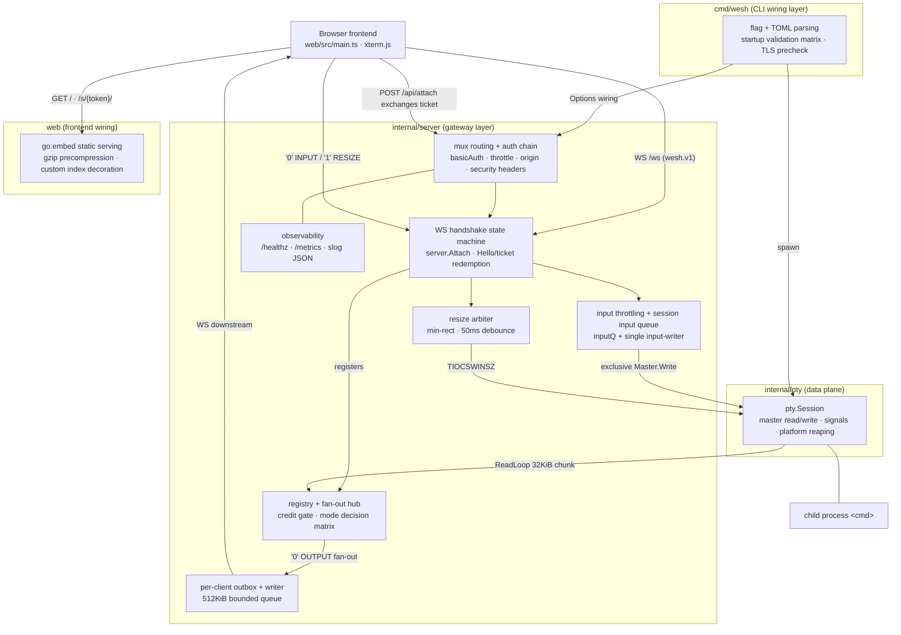

<!-- English translation of ARCHITECTURE.md. The Chinese ARCHITECTURE.md is the primary copy and is
     maintained by the documentation toolchain ("gsd-doc-writer"); keep this translation in
     sync whenever the primary copy changes. Not generated — do not add a gsd-doc-writer marker. -->

# wesh Architecture

**English** | [简体中文](ARCHITECTURE.md)

## System Overview

wesh is a command-line tool that shares a terminal over the Web: `wesh [flags] -- <cmd> [args...]` starts an HTTP/WebSocket service on the specified port, and opening the page in a browser yields a complete interactive terminal running `<cmd>`. The overall design is a **single-binary layered architecture** — the Go server (CLI parsing/wiring layer → HTTP+WS gateway layer → PTY data-plane layer) embeds an xterm.js frontend built by Vite into a single file (`go:embed`). Since v1.1 the process model supports dual modes (`--session-mode`, see the "Dual-mode architecture" section): `shared` (default) — the PTY child process is spawned once when the server starts, and multiple browser clients share the same session (output fanned out in real time, write permission arbitrated via owner promotion); this is wesh's own differentiating design (erratum: the v1.0 documentation classified the shared model as being in the same category as GoTTY — verification against the GoTTY source shows that GoTTY is in fact per-connection spawn: each WS connection performs its own `factory.New` → `pty.Start` of a process, so the earlier statement was wrong; the shared model has no precedent among comparable tools); `per-client` — each WS client spawns an independent PTY process on attach (ttyd-style per-connection lifecycle), terminated on disconnect and freshly spawned on reconnect. The main input is browser keyboard/paste bytes and RESIZE events; the main output is the byte stream of the PTY child process (`shared` fans out to ×N clients / `per-client` gives each session an independent stream); the wire layer is a custom binary WebSocket protocol `wesh.v1` (1-byte frame type + payload). The supported platforms are linux/darwin only (amd64/arm64); Windows is out of scope (PTY layer build-tag constraint).

## Component Diagram



HTTP route surface (wired by `server.Handler()`, uniformly prefixed when `--base-path` is set): `GET /` and `/s/{token}/` (embedded page/share link), `POST /api/attach` (exchanges a one-time ticket), `/ws` (WS upgrade), `GET /healthz` (auth-free health check; the root path is fixed and unaffected by base-path), `GET /metrics` (Prometheus text, 21 series, behind the auth gate; series of the same name such as `session_active` take values by mode, and the four spawn counters are per-client-only, retained on the shared side as always-0 series).

## Data Flow

**Connection establishment (browser → server)**

1. The browser `GET /` fetches the embedded single page (`web/embed.go`: `go:embed all:dist`, gzip precompression bypass + `Vary: Accept-Encoding`); with a `--index` custom index the entire served byte stream is replaced by that page.
2. In authenticated mode the frontend `POST /api/attach` (Basic credentials obtained via a 401 challenge) exchanges a one-time ticket (128-bit `crypto/rand`, single use, 60s TTL, bound to ro/rw mode); in unauthenticated mode this endpoint returns 404, on which basis the frontend skips ticket acquisition and connects directly to WS.
3. A WS connection to `/ws` must negotiate the subprotocol `wesh.v1`; the handshake guard chain (`server.Attach`): Origin whitelist check (403) → subprotocol precheck (400) → per-IP half-open limit of 8 (429) → `--max-clients` saturation 503 gate → Accept.
4. The first frame must be Hello `{"version","cols","rows","ticket"?}` — 5s timeout, pre-auth read limit 4KiB; ticket redemption failure is uniformly `auth_failed` + 1008 (no distinguishing oracle).
5. After successful redemption it enters the mode decision matrix (ticket-bound mode × `--writable` × `--write-policy` × owner in place → effective ro/rw), registers into the client table, and replies with Welcome `{"mode","session","cols","rows","prefs"?}` (session is the session-mode bit and is always serialized; cols/rows are always present — for shared they are the session dimensions, for per-client they echo this end's Hello dimensions); the steady-state read limit switches to 16KiB, and the pinger keeps the connection alive per `--ping-interval` (default 5s), disconnecting on a 10s pong timeout.

**Output path (PTY → browser)**

1. `pty.Session.ReadLoop` (`internal/pty/io.go`) reads the master in a loop with a 32KiB buffer, invoking the `onChunk` callback per chunk.
2. `onChunk` (`clients.go`) holds hubMu: it first passes the global credit gate (all writable ends' outboxes full → hold the chunk and stop reading the PTY, forming backpressure), then frames `'0' + chunk` and calls `outbox.trySend` per client.
3. Each client's outbox is a 512KiB bounded queue, drained by an independent writer goroutine that batch-writes to WS — a slow client does not drag down the others.
4. Full-queue handling: an ro end is immediately kicked with 1013; an rw end is kicked when outside the attach grace period (500ms) and a healthy writable end exists, otherwise the credit protection bit is set (the owner/presenter is not spuriously evicted), and after recovering to the 50% watermark the buffered frames are re-delivered and the gate is opened.

**Input path (browser → PTY)**

1. INPUT frames pass through each client's read loop: first the per-client mode gate (input from an ro end is silently dropped by the server — read-only is a server-side boundary), then the rate limiter (sustained 32KiB/s, burst 64KiB; over-limit is silently dropped).
2. The payload enters the session-level bounded `inputQ` (256KiB), and a **single input-writer goroutine** exclusively holds `Master.Write` — the read loop performs zero synchronous writes.

**RESIZE path**

RESIZE frames `{"cols","rows"}` are clamped to [1,1000] and then enter the arbiter (`resize.go`): with ≥2 ends, take the minimum common rectangle of the participation set (the participation set is layered by write permission: owner mode takes only the owner, all mode takes all rw ends, pure-ro sessions take all ro ends' first Hello dimensions); after 50ms debounce TIOCSWINSZ is committed, and session dimension changes are pushed to all ends as a constraining viewport via `'W'` frames.

**Termination path**

- Child process exit (the only termination path in shared mode; for per-client, sessionWatcher unicasts EXIT privately and pcSupervisor handles a second termination source — see the "Dual-mode architecture" section): the lifecycle goroutine broadcasts an EXIT `'X'` frame (`{"exit_code","message"}`, exit_code=-1 for death by signal) → closes all clients with 1000 → `exitf` exits with the child process's exit code.
- SIGTERM/SIGINT graceful shutdown: send 1001 to all clients (close reason `server_shutting_down`; the frontend terminal panel does not auto-reconnect) → run the stop-signal sequence against the child process group (`--stop-signal` → `--stop-timeout` grace → SIGKILL; for per-client, signal each group from a snapshot of the N process groups + bounded join — upper bound `--stop-timeout` + 2s margin; any D-state remnant not reaped by the deadline is terminated directly to close out, never waiting indefinitely).
- `--once` / `--exit-when-empty` empty trigger: send SIGHUP to the child process group; wesh exits with status 255.

## Dual-mode architecture

The implementation discipline of `--session-mode` is **one fork at wiring time, zero forks at runtime**: the mode is fixed at wiring time in `New` (goroutine topology and component assembly) and `Attach` (the upgrade branch), and the runtime hot path never branches on mode type — no unified session interface is abstracted; the two modes are wired directly and separately, and the repository's explicit branch points converge to nine decision surfaces, categorized into two kinds by gate form — six `sessionMode` type checks (`New` wiring fork, `Attach` upgrade fork, the two immediate/grace trigger points of the exit-when-empty termination branch, the `Shutdown` closure branch, and the session_active value branch of `/healthz` and `/metrics`) and three `client.pc` indirect-field type checks (RESIZE pass-through, and the two teardown hook points of detach/kick). INPUT is a zero-branch surface: the `client.inQ` indirect field lets the same line of read-loop code write the session-level queue in shared mode and this session's exclusive queue in per-client mode. per-client additionally has three groups of purely additive mechanisms absent from the shared variant: the spawn dual token buckets (global 8/s·burst 16 + per-IP 1/s·burst 4 — the fork defense against network-partition thundering herds / single-point churn; rejections are uniformly Error + 1011 capacity wording and do not fall into the frontend's auto-reconnect trigger set); the outbox notFull recovery signal + zero-lock-blocking frame holding + dwell watchdog (10s) backpressure trio — stopping reads without dropping frames, "a slow but progressing client is never kicked"; and sessionWatcher, the sole reaper per session, + teardown `sync.Once` + the reaped/waitDone double fence — termination exactly once, kill-after-reap structurally impossible.

Goroutine topology comparison (source of truth: the five-piece wiring in `internal/server/perclient.go` and the shared wiring in `server.go`; the production ledger is shared 3+3N / per-client 1+6N; see the README's "per-client resource obligations and benchmark calibration" section for measured calibration):

```mermaid
graph TD
    subgraph SH["shared mode (default) · session-level 3 + client-level 3×N"]
        SPTY["PTY child process ×1<br/>spawned once at startup"]
        SRL["ReadLoop (session-level)<br/>onChunk holds hubMu and fans out ×N through the fan-out hub<br/>global credit gate hubCond backpressure"]
        SIW["inputWriter (session-level)<br/>session-level inputQ → exclusive Master.Write"]
        SLC["lifecycle (session-level)<br/>child dies → EXIT broadcast → exitf"]
        SAR["resize arbiter<br/>min-rect · participation-set layering · 50ms debounce"]
        SCL["per client ×N<br/>reader · writer · pinger"]
        SPTY -->|"32KiB chunk"| SRL
        SRL -->|"OUTPUT fan-out"| SCL
        SCL -->|"INPUT"| SIW
        SIW --> SPTY
        SCL -->|"RESIZE"| SAR
        SAR -->|"TIOCSWINSZ"| SPTY
        SLC -.->|"EXIT broadcast + 1000"| SCL
    end
    subgraph PC["per-client mode (opt-in) · service-level 1 + session-level 6×N"]
        PSUP["pcSupervisor ×1<br/>--once / exit-when-empty second termination source"]
        PPTY["PTY child process ×N<br/>spawned at attach"]
        PRD["reader read loop<br/>ro gating + input throttling"]
        PWR["writer<br/>outbox 512KiB drain"]
        PPI["pinger"]
        PRL["ReadLoop closure<br/>1:1 direct delivery to the owner outbox + dwell watchdog"]
        PIW["inputWriter<br/>per-session exclusive inputQ"]
        PSW["sessionWatcher<br/>sole reaper · private direct EXIT write"]
        PPTY --> PRL
        PRL --> PWR
        PRD -->|"INPUT"| PIW
        PIW --> PPTY
        PRD -->|"RESIZE pass-through TIOCSWINSZ"| PPTY
        PSW -.->|"cmd.Wait sole reaping"| PPTY
        PSUP -.->|"wait for pcSessions to reach zero → exitf"| PSW
    end
```



Component differences between the two modes (keep / degrade / vanish):

| Destination | Components and mechanisms |
|------|-----------|
| **vanish** (shared wiring only) | fan-out hub (output fan-out + global credit gate hubCond) · resize arbiter (per-client dimension pass-through + per-session debounce) · owner promotion and the write-permission arbitration matrix · `'W'` constraining frames (per-client's Welcome echoes its own dimensions) |
| **degrade** (mechanism retained, semantics changed) | EXIT frame broadcast → private unicast (server shutdown decoupled from child process death) · `--once`/`--exit-when-empty` trigger conditions unchanged, termination target 1 → N process groups (handled by pcSupervisor) · graceful shutdown stop-signal sequence executed once per process group · ro/rw share links from "credentials for a view of the same session" → "admission tickets for an independent process at the permission level" · `--max-clients` connection gate doubling as a process gate (handshake 503 + recheck before spawn) · Welcome cols/rows from "session dimensions" → "own dimensions" |
| **keep** (mode-independent, zero changes) | ticket redemption · auth-failure throttling · Origin whitelist · per-IP half-open limit · TLS/security headers · the two read-limit tiers · ping/pong keepalive · close-code discipline · 1006-only reconnect backoff · env whitelist · privilege dropping · `/healthz` · `/metrics` · audit logging · `[ro]` title prefix · three-tier `--client-option` preference override |

For the user-facing description of mode semantics (share links / ro / herdr·tmux convergence) and per-client resource obligations, see the README's "Session modes" section.

## Key Abstractions

| Abstraction | Location | Description |
|------|------|------|
| `pty.Session` | `internal/pty/spawn.go` | child process + PTY master wrapper: `Start` (exec array not going through a shell, replacement-style injection of the env whitelist, privilege dropping via Credential), `ReadLoop`, `Resize`, `SignalGroup` (negative-pid process-group signaling) |
| `proto` package | `internal/proto/proto.go` | single source of truth for the wire protocol: frame type constants (`'H'`/`'W'`/`'E'`/`'0'`/`'1'`/`'X'`), payload structures, `Subprotocol = "wesh.v1"`, the two read-limit tiers, dimension clamping; the frontend `main.ts` frame constants are manually aligned with it |
| `server.Server` | `internal/server/server.go` | gateway and session lifecycle closure: `New` wiring (pins down the three goroutines ReadLoop/inputWriter/lifecycle), `Handler()` route tree, `Attach` WS handshake state machine, `Shutdown` graceful shutdown |
| `server.Options` | `internal/server/server.go` | configuration fixed at wiring time (write permission/keepalive/auth/capacity/backpressure/session mode/deployment shape, including the four spawn dual-token-bucket parameters and SlowDwell); zero-value fallbacks are centralized in `New` |
| `client` / `outbox` / `registry` | `internal/server/clients.go` | multi-client hub: a bounded outbox per client (with a notFull recovery signal) + an independent writer; the registry + global credit gate (`hubCond`) form fan-out backpressure; owner FIFO promotion |
| `inputQ` + input-writer | `internal/server/clients.go` | session-level bounded input queue + a single writer goroutine exclusively holding master writes (the read loop performs zero synchronous writes) |
| `pcSession` / `upgradePerClient` / `sessionWatcher` / `teardownPCLocked` | `internal/server/perclient.go` | backbone of the per-client session lifecycle: the upgrade spawn branch (dual-token-bucket decision → capacity re-gate → spawn outside hubMu → recheck and reclaim at the registration point), five-goroutine wiring, EXIT privatized direct write, `sync.Once` teardown (reaped/waitDone double fence), dwell watchdog; the companion `spawnThrottleStore` (`internal/server/spawnthrottle.go`) carries the spawn dual token buckets |
| `arbiter` | `internal/server/resize.go` | resize arbitration: pure functions min-rect/last-wins + participation-set layering + the dual debounce/immediate-recompute channels, all fields protected by hubMu |
| `ticketStore` / `throttleStore` / `shareTokens` | `internal/server/tickets.go` / `throttle.go` / `sharetoken.go` | the three auth primitives: one-time ticket (60s TTL), per-IP exponential backoff (doubling from 1s, capped at 30s), ro/rw share token (128-bit, stored SHA-256 pre-hashed, invalidated on restart) |
| `web.Handler()` / `WithCustomIndex` | `web/embed.go` | go:embed static serving: gzip precompression bypass, `Vary` header discipline, `--index` custom index byte-identity whole-page replacement decoration |
| frontend `main.ts` + `lib/` | `web/src/` | xterm.js terminal wiring (fit/webgl/unicode11/web-links/clipboard five addons), wesh.v1 protocol frame send/receive, three-tier preference override (URL query > `--client-option` > built-in defaults), automatic reconnect on abnormal disconnect (exponential backoff from 1s capped at 30s), title sync/hyperlinks/clipboard |

**Concurrency discipline**: a single lock `hubMu` guards the registry/credit gate/arbiter (lock order `hubMu > outbox.mu`, never held in reverse order); `exitf` is injected by main as `os.Exit` and by tests as a capture stub; runtime events always go out through the slog JSONHandler single outlet to stderr, and credentials/tickets/share tokens never enter the logs in any form.

## Directory Layout

```
wesh/
├── cmd/wesh/          # CLI entry: flag + TOML parsing (config.go), startup validation matrix,
│                      #   TLS cert precheck, custom index loading, share link generation, signal handling
├── internal/          # server implementation (Go internal packages, not externally importable)
│   ├── pty/           # PTY data plane: spawn (exec array + env whitelist + privilege dropping),
│   │                  #   master read/write, platform reaping (reap_linux pidfd / reap_darwin kqueue),
│   │                  #   process-group signaling (signal_linux / signal_darwin build-tag branches)
│   ├── proto/         # single source of truth for the wire protocol: frame types, payloads, subprotocol, read limits
│   └── server/        # HTTP+WS gateway: handshake state machine, multi-client registry and fan-out/backpressure,
│                      #   auth/throttling/share tokens, resize arbitration, per-client session life
│                      #   cycle (upgrade spawn / five-goroutine wiring / reaping teardown),
│                      #   health checks and metrics, slog JSON audit logging, TLS/security headers/Origin/reverse proxy trust
├── web/               # frontend: src/main.ts + src/lib/ (TypeScript + xterm.js 6),
│   │                  #   vite-plugin-singlefile builds a single HTML into dist/,
│   │                  #   embed.go embeds it into the binary via go:embed; uat/ holds protocol-layer UAT scripts
├── deploy/            # systemd unit template (wesh.service)
├── scripts/           # release.sh release script (prechecks → tests → build → fuzz → tag)
├── docs/              # project documentation (ARCHITECTURE.md, CONFIGURATION.md, etc.)
├── Dockerfile         # reference image (FROM scratch + static binary + tini, user-built)
└── README.md          # project overview: installation, quick start, usage examples, documentation index
```

**Organizing principles**: the three packages under `internal/` are split by data-plane responsibility — `pty` only manages the child process and master bytes (decoupled from the session control plane), `proto` is the single source of the protocol constants shared by frontend and backend (preventing double-write drift), and `server` carries the entire control plane and multi-client logic; `web` is an independent pnpm package whose build artifact `dist/` enters the binary via `go:embed` (the frontend build must precede `go build`), converging the deployment shape to "scp a single file and run". External dependencies are deliberately minimal: `coder/websocket` (WS implementation), `creack/pty` (PTY wrapper), `golang.org/x/sys` (platform syscall wrappers — TIOCGPGRP/SIGWINCH/kqueue), `golang.org/x/time` (rate limiting), `pelletier/go-toml/v2` (config parsing) + stdlib (Prometheus text metrics, slog, and the net/http mux are all hand-written/built-in, zero heavy frameworks).
