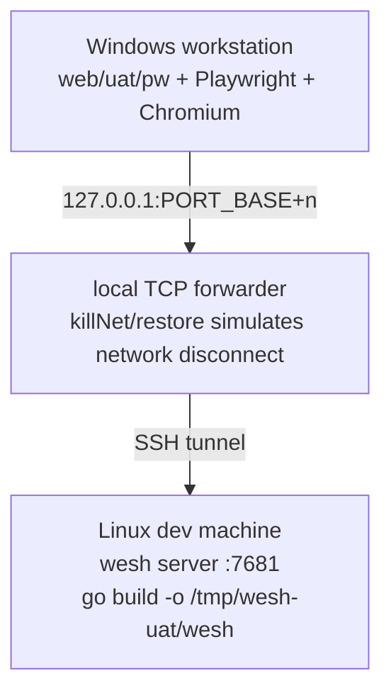

<!-- English translation of TESTING.md. The Chinese TESTING.md is the primary copy and is
     maintained by the documentation toolchain ("gsd-doc-writer"); keep this translation in
     sync whenever the primary copy changes. Not generated — do not add a gsd-doc-writer marker. -->

# wesh Testing Guide

**English** | [简体中文](TESTING.md)

The wesh test system is composed of three wings: **Go unit tests** (standard library `testing`, test files co-located with the source, covering all server-side logic; since v1.1, `t.Run("mode=…")` subtests naturally cover both the shared/per-client process models), the **layered UAT system** (zero-dependency Node scripts under `web/uat/`, making end-to-end assertions against the real build artifact) and **load calibration tests** (heavyweight cells isolated by the `//go:build load` tag, run manually). The three are mutually independent: Go unit tests and load cells need no Node, UAT does not enter CI, and both are executed on demand locally or in the two-machine environment.

## Overall test structure

The UAT system is divided into five layers by "how close to the browser" (and is also the established test strategy recorded in the project's CODEBUDDY.md):

| Layer | Name | Vehicle | Dependencies | Run side |
|----|------|------|------|--------|
| 1 | Protocol layer | `web/uat/phaseNN.mjs` (phase02–09, 11–14; `run-all.mjs` one-shot matrix) | Zero dependencies, Node ≥ 22 native WebSocket/fetch (phase14 additionally needs `herdr`) | Linux (headless OK) |
| 2 | Terminal core logic | `web/uat/*-t1-width.mjs`, `phase05-dims.mjs` | `@xterm/headless` (pure JS, no native dependencies) | Linux (headless OK) |
| 3 | Frontend DOM logic | `web/uat/phaseNN-dom.mjs` | `jsdom` + Node native WebSocket/fetch | Linux (headless OK) |
| 4 | Browser live-test layer | `web/uat/pw/` | Playwright driving real Chromium | Windows GUI workstation (two-machine) |
| 5 | Platform-native behavior | — (explicit exemption, non-blocking) | — | Manual / screenshot archive |

The core logic of the layering: **each layer only tests the surface it can assert precisely** — the protocol layer asserts bytes and frame ordering; `@xterm/headless` and the browser frontend take the same buffer code path, so wide-character cell occupancy and cursor position can be asserted precisely; jsdom asserts DOM logic such as gating/debounce/panel rendering (no layout engine, layout uses fixed stubs); the Playwright layer covers the look-and-feel behavior that neither the protocol layer nor jsdom can reach (panel copy verbatim, countdown, title prefix, clear-screen redraw). Layer 5 is an explicit exemption: real OS NIC network disconnect timing, browser permission prompts, native confirm dialogs, real OS IME stack, pixel visuals — not listed as blocking, recorded as `skipped` + reason with accepted risk.

## Test framework and prerequisites

**Go side**: standard library `testing`, no third-party assertion/test framework. The style is table-driven tests + external test packages (`package server_test`). Fuzz targets use the standard library `go test -fuzz`. Prerequisites: Go ≥ 1.26.3 (`go.mod` pinned). A bare clone can run `go test ./...` directly — the repository commits the `web/dist/index.html` build artifact (the real terminal page) to satisfy the `go:embed` compile requirement.

**UAT side**: no test framework; each script carries a lightweight `check()` assertion collector, prints `PASS/FAIL` lines and a summary, and expresses the gate result via exit code 0/1. The dependencies are split across three independent packages:

| Package | Install | Purpose |
|----|------|------|
| `web/` | `pnpm -C web install` | The frontend itself (the DOM layer loads its build artifact `web/dist/index.html`) |
| `web/uat/` | `pnpm -C web/uat install` | Needed by layers 2/3: `jsdom`, `@xterm/headless`, `@xterm/addon-unicode11` |
| `web/uat/pw/` | `pnpm -C web/uat/pw install --ignore-workspace` | Needed by layer 4: `playwright` (independent package, not attached to the web/ workspace) |

Two things to note:

- **The frontend build must come first** (after modifying `web/src/`): `pnpm -C web build` produces a new `dist/index.html`, so that what the DOM layer and the browser live-test layer assert against is the new code; the build also performs tsc type checking.
- **Protocol-layer scripts are zero-dependency**: the phaseNN.mjs main line uses only Node ≥ 22 built-in capabilities (native `WebSocket`/`fetch`/`net`) and does not depend on `web/uat/node_modules`, so it runs whether or not dependencies are installed; only the `-dom.mjs` and xterm headless style scripts require installation.

## Running tests

### Go unit tests

```bash
go test ./...                                  # full suite (runs directly on a bare clone)
go test -race -count=1 ./...                   # same as CI (race detection; needs CGO, do not set CGO_ENABLED=0)
go vet ./...                                   # static checks (CI gate)
go test ./internal/server/                     # single package
go test -run TestEchoPTY ./internal/server/    # single test function
go test -race -run TestKqueueExitZombieRace ./internal/pty/   # darwin-only test (excluded on Linux by build tag, needs macOS)
go test -run 'TestAttachFlow/mode=per-client' ./internal/server/   # dual-mode subtest filtering (v1.1 dual-run machinery, see below)
go test -tags=load -count=1 -timeout=30m -v ./internal/server/     # load calibration cell (heavyweight, manual, not in CI, see below)
```

Coverage by package:

| Package | Test files (co-located with the source) | Coverage |
|----|--------------------------|--------|
| `cmd/wesh` | `main_test.go`, `config_test.go`, `fuzz_test.go` | CLI parsing contract (table-driven, locking all flag semantics), startup validation matrix, TOML config loading (`FuzzDecodeFileConfig`) |
| `internal/server` | 34 `*_test.go` (32 test files + `harness_test.go` dual-mode wiring machinery + `export_test.go` export bridge; auth/tickets/handshake/multi/resize/keepalive/throttle/origin/tls/proxy/metrics/health/slowclient/limits/e2e/perclient/exit etc.) | WS handshake state machine, one-time ticket, multi-client fan-out and write-permission arbitration, resize debounce, keepalive/eviction, auth throttling, Origin whitelist, reverse proxy header handling, observability endpoints, graceful shutdown, full per-client independent session semantics; includes 216 `mode=` dual-mode subtests and the `load_test.go` load cell (build tag isolated) |
| `internal/pty` | `spawn_test.go`, `io_test.go`, `signal_test.go`, `reap_test.go`, `reap_darwin_test.go` | PTY spawn/read-write/signals, process reaping; the darwin-only file (`//go:build darwin`) carries the kqueue exit race decision and runs only on the macOS CI leg |
| `internal/proto` | `proto_test.go`, `fuzz_test.go` | wesh.v1 frame encode/decode (`FuzzDecodeHello`/`FuzzDecodeResize`: arbitrary input never panics + dimension clamping invariant) |
| `web` | `embed_test.go` | Accept-Encoding gzip negotiation parsing |

Two ways to run fuzz targets:

```bash
go test -fuzz=FuzzDecodeHello -fuzztime=60s ./internal/proto/      # CI short-run gate (60s)
go test -fuzz=FuzzDecodeFileConfig -fuzztime=60s ./cmd/wesh/
go test ./cmd/wesh/    # regular mode: committed seeds and crash corpus (cmd/wesh/testdata/fuzz/) replay as ordinary unit tests with zero fuzz time
```

### Go dual-mode test machinery (v1.1)

The server has two process models: shared (a single session fanned out to multiple clients) and per-client (an independent PTY per client). Since v1.1, tests for both models are carried out within the same set of test files through unified wiring machinery; `internal/server/harness_test.go` provides a small mode-parameterized wiring family:

- `newTestServer` (plain binary form), `newTrackedTestServer` (+stderr sync edge), `newHandleTestServer` (+white-box srv), `newSessTestServer` (+PTY session set accessor) — the first parameter `mode` takes `server.SessionModeShared` / `server.SessionModePerClient`; the two branches of the family each pass straight through to the parent wiring function with zero behavior rewriting; an unknown mode always hits `t.Fatalf` (fail-fast).
- Zero change to the CI structure: the single step `go test -race -count=1 -v ./...` naturally covers both modes via `t.Run("mode=shared"/"mode=per-client")` subtests, with zero diff in ci.yml. The repository currently has **216 `mode=` subtests**, and a full `-race` run of all five packages is green (about 2m46s measured on the reference dev machine; the magnitude varies with the machine).

Each test is classified along three dimensions by the relationship between its assertions and the process model (**`t.Skip` is rejected** — skipping to get green is strictly forbidden):

| Dimension | Semantics | Precedent |
|------|------|------|
| mode-agnostic | Both columns execute the same assertion body; the same expected values are dual-run | handshake, metrics auth gate, basepath, customindex, sharetoken, proxy e2e, limits |
| mode-mapped (assertion fork table) | When the true values are opposite for the two modes, the fork is made explicit as a table with the expectation written out per column (the shared-column expectation is verbatim identical to the pre-v1.0 refactor baseline) | exit_test (EXIT broadcast: shared = all clients receive the same frame / per-client = EXIT is privatized and other clients are unaware), multi_test (fanout true values are opposite, MaxClients capacity follows the spawn-intent accounting) |
| mode-exclusive (explicitly asserting not wired) | The per-client column explicitly asserts the falsifiable negative "this behavior is not wired" | the four multi_test owner tests — owner disconnect/removal triggers no promotion whatsoever (other clients' permissions/roles unchanged, no promoted Welcome frame); were promotion mis-wired, the silent-window assertion would turn red |

Known flake: `TestMaxClients503/mode=per-client` exhibits a pcSessions linger-window race flake in the isolated non-`-race` re-run form filtered with `-run`; the full `-race` run (the same command as CI) is unaffected, and the fix direction has been registered.

### UAT protocol layer / terminal core / DOM layer (Linux side)

Common convention: first build the binary to the default path `/tmp/wesh-uat/wesh`, then run it with `node web/uat/phaseNN.mjs` (most scripts accept the binary path as the first argument to override the default; the scripts spawn a real server instance themselves, listening on a random port on `127.0.0.1`):

```bash
pnpm -C web build                                  # the DOM layer needs the latest build artifact
pnpm -C web/uat install                            # DOM/xterm layer dependencies (can be skipped for the protocol layer)
go build -o /tmp/wesh-uat/wesh ./cmd/wesh
node web/uat/phase02.mjs                           # run a single phase
node web/uat/phase04-dom.mjs /tmp/wesh-uat/wesh    # explicitly specify the binary path
```

Vehicle registry (`web/uat/`):

| Script | Layer | Coverage |
|------|----|--------|
| `phase02.mjs` | protocol | ro/rw basic handshake, exit broadcast, version mismatch, Hello timeout, multiple clients |
| `phase03.mjs` | protocol | full auth/ticket flow, brute-force throttling, Origin whitelist, TLS, security headers |
| `phase04.mjs` | protocol | Welcome prefs shape, `--client-option` startup validation |
| `phase05.mjs` | protocol | full share link chain, two-client consistency, capacity-full 503, 1013 slow-consumer eviction, promotion, session size delivery |
| `phase06.mjs` | protocol | EXIT broadcast to both ends, signal death mapping, `--once`, both forms of `--exit-when-empty`, reconnect after disconnect to the same PTY |
| `phase07.mjs` | protocol | TOML config merge precedence, full unix socket chain, base-path, auth-header logging and sanitize |
| `phase08.mjs` | protocol | `/healthz`, `/metrics` auth gate and exposition, audit log events |
| `phase08-journal.mjs` | protocol | usability regression of the jq examples under journald merged streams (README examples verbatim) |
| `phase09.mjs` | protocol | full behavior of the `--index` custom homepage (startup validation / page serving over three channels / size limit) |
| `phase11.mjs` | protocol | eight per-client protocol-layer scenarios: independent pids on the two ends do not cross over, first-frame winsize=Hello clamping, runtime spawn-failure injection when the command is deleted, disconnect with pgid ESRCH leaving no zombies, EXIT privatization, `--max-clients` capacity re-gate, disconnect and reconnect yields a brand-new process, trap immunity + KILL fallback |
| `phase12.mjs` | protocol | six dual-mode comparison scenarios: Welcome.session mode bit, resize pass-through isolation between the two ends, ro RESIZE pass-through, ro INPUT discard, no frame loss while reads are stalled (RawStallClient raw socket stall fixture), 10s+ dwell real wait → 1013 |
| `phase13.mjs` | protocol | six scenarios of defense lines and termination semantics: churn throttling + XFF key rotation, KILL fallback default 5s, process-level 255 for the three exit forms, Shutdown N groups with 1001 on both ends, four metrics counters with zero-identity labels, `WESH_REMOTE_USER` env injection chain |
| `phase14.mjs` | protocol (herdr driving) | three-channel mutual corroboration of herdr driving (herdr area flip chain / wesh dual session_start with two pids / stream-layer incremental relation assertions) + ro convergence share link false-green guard; requires `herdr` installed on the Linux side, with session isolation via `wesh-uat-p14-*` named sessions |
| `phase04-t1-width.mjs` | terminal core | CJK/emoji wide-character cell occupancy and cursor position (Unicode11 activated) |
| `phase05-dims.mjs` | terminal core | rendering-equivalence lock for the session size constraint across two ends of different sizes |
| `phase04-dom.mjs` | DOM | gating/debounce/conditional registration/prefs application/protocol frame consumption (loads the real dist bundle) |
| `phase05-dom.mjs` | DOM | ro three-element gating, promotion UX, dedicated panels for 1013/503/invalid link |
| `phase06-dom.mjs` | DOM | reconnect state machine logic surface (1006 automatic reconnect, boundary of the dedicated manual panel) |
| `phase12-dom.mjs` | DOM | full per-client reset chain (`terminal.reset()` ⊇ clear discrimination: alt-screen ghosting does not come back), ro resize with real upstream RESIZE + rendered-size fit following, Welcome compatibility for old servers lacking the session key |
| `phase07-b1b5.sh`, `phase07-b2.mjs`, `phase07-b3.mjs`, `phase07-b6.sh` | protocol (auxiliary) | socket concurrency/EADDRINUSE, multi-value headers, `--cwd`/`--term`/`--stop-timeout`, `--open`×TLS; **the binary path is hardcoded to `/tmp/wesh-uat/wesh`** |
| `phase05-flood-driver.mjs` | (auxiliary) | flood driver child process, invoked by `phase05-dom.mjs`, not run standalone |
| `minrepro-p14.mjs` (web/uat/), `pw/minrepro-win.mjs` | (auxiliary) | standalone minimal-reproduction vehicles (one each for Linux/Windows) for "the output stream dies non-deterministically after the first keystroke in the browser tab" during Phase 14 execution; for debugging, not in the matrix |

All scripts print `PASS/FAIL` line-by-line results + a summary at the end (e.g. `结果: 12/12 协议断言通过`), return a non-zero exit code on failure, and can be wired directly into a shell loop for batch runs.

### One-shot matrix runner (Linux side)

```bash
node web/uat/run-all.mjs                             # all 17 items; a missing binary triggers an automatic go build (on failure it prints guidance and exits 1)
node web/uat/run-all.mjs '' phase11 phase12 phase13  # filter a subset (when using the default binary, '' is the first-arg placeholder so the argument-shift guard blocks a script name from being passed by mistake)
node web/uat/run-all.mjs /path/to/wesh phase14       # explicit binary path + filter
```

The matrix has 17 items = 12 protocol (phase02–09, 11–13) + 4 jsdom (phase04/05/06/12-dom) + 1 herdr (phase14, containing real waits and placed last). Execution discipline: **serial** (so that inter-script process cleanup and port release do not interfere with each other) + a per-script **10min timeout guardrail** (SIGTERM the whole process group, SIGKILL fallback after 2s; a timeout turns into FAIL and does not block subsequent scripts). The runner body itself has zero assertions and zero parsing — gate semantics belong to each sub-script's existing exit code 0/1, and the output merely adds a `[script name]` line prefix (sensitive-value self-scrubbing belongs to each sub-script). Exit codes: all green 0 / any failure 1 / usage error (including unknown script names, to prevent silently running an empty set) 2. The pw layer is not part of the matrix (hard constraint of the two-machine topology) — the closure gate is a manual two-stage process: Linux runner all green + Windows pw all green.

### Browser live-test layer (Windows GUI side, two-machine model)

Layer 4 can only run on a machine with a GUI: Playwright drives the local real Chromium and connects, through the local TCP forwarder (kill/restore simulating network disconnect RST semantics), to the wesh server on the SSH-reachable Linux side. Building or running wesh on the Windows side is **forbidden** (no Windows PTY support), and manipulating a real NIC to simulate a network disconnect is also **forbidden**.



```bash
# Windows side (first time)
pnpm -C web/uat/pw install --ignore-workspace
npx playwright install chromium

# Run (about 2 minutes for the full set; the Linux side must be reachable via SSH BatchMode and already built)
WESH_UAT_SSH=user@host WESH_UAT_SSH_PORT=36000 pnpm -C web/uat/pw uat:06
node web/uat/pw/phase06-pw.mjs t1          # single-item debugging
```

Vehicles: `phase06-pw.mjs` (six items covering network-disconnect reconnect / the full look-and-feel chain), `phase07-a2-pw.mjs` + `phase07-a2-ctl.sh` (full two-machine chain through a real nginx reverse proxy sub-path), `phase09-caddy-pw.mjs` + `phase09-caddy-ctl.sh` (full two-machine chain through the Caddy reverse proxy), `phase12-pw.mjs` (real browser resize look-and-feel — the real fit chain that the jsdom fixed-layout stub cannot reach: zoom follows / shrink falls back / return to original size with zero drift), `phase14-pw.mjs` (herdr driving dual-tab look-and-feel: after attaching on mobile, the desktop panel border column position is verbatim unchanged; typing/observability go through the Node bare-WS driver end, and the two browser tabs are purely passive rendering observers). All entry points are `node web/uat/pw/phaseNN-pw.mjs` (`pnpm -C web/uat/pw uat:06` is the shortcut form for phase06). The artifacts are `results.json` (structured results) and `screenshots/` (look-and-feel archive, gitignored). The environment variable table and the principle of the network-disconnect simulation are in `web/uat/pw/README.md`.

### Load calibration tests (`//go:build load`, manual runs)

The entire `internal/server/load_test.go` file carries the `//go:build load` tag (it must be the first line of the file) and is completely isolated from the regular `go test ./...` and CI — the load cell is a heavyweight manual channel. Calibration discipline: **verification first, change only on falsification** — by default it verifies that the current values hold (zero spurious eviction of legitimate slow readers, the memory upper bound holds, the credit gate open/close frequency is acceptable), and constant defaults are changed only when data falsifies them (the flag surface is left untouched); each cell emits a `LOADDATA` line (key-value pairs such as clients/profile/kicks/gate_transitions/outbox_max/alloc_peak/alloc_base/dur_ms), which is the direct data source for backfilling the README calibration table.

```bash
go test -tags=load -count=1 -timeout=30m ./internal/server/ -v
```

| Test | Profile | Core assertions |
|------|------|----------|
| `TestLoadFanoutMatrix` | shared fan-out to {1,4,16,32} clients × seq flood (~33.8MB per client, all actively reading) | all clients receive equal byte counts + the trailing field of the stream tail reaches the end of the flood + `kicks==0` + amplification ratio `ws_sent ≥ N×pty_output` |
| `TestLoadLegitSlowReaderZeroKick` | drip-feed production ~205KB/s + a reader throttled to 400KB/s | `kicks==0` throughout (zero spurious eviction of legitimate slow readers) + byte-for-byte equal stream reception between fast and slow clients (zero frame loss) |
| `TestLoadMemoryBound` | 32-client flood memory profile | Alloc peak ≤ 64MiB (4× the worst case on paper) + return to baseline ±50% after GC |
| `TestLoadGateTransitions` | burst ~2.2MB/s × a reader throttled to 600KB/s | credit gate transitions ≥2 and ≤10 per second (half-watermark hysteresis does not oscillate) + `kicks==0` |
| `TestLoadDefunct` | 200 rounds of high-frequency spawn/teardown (Linux-only, /proc accounting) | goroutine/fd return to baseline +4 tolerance + zero Z state among all child processes that ever existed |
| `TestChurnPerClientSpawnThrottle` | 10rps × 30s churn (production default throttle bucket, zero overrides) | `throttled>0` (the defense line took effect at least once) + `spawn_total==attached` program-order cross-check + upper bounds on the gor/mem/fd deltas |
| `TestLoadPerClientFloodMatrix` | per-client {1,4,16,32} sessions each flooding independently (each client sends one triggering INPUT apiece) | consistent stream reception per client + `spawn_total==N` program-order cross-check + `kicks==0` |
| `TestLoadPerClientResident` | per-client sh with zero-input residency (Linux-only, residency-stability gate polling) | mem ≤ N×(768KiB+ε) / gor ≤ baseline+6N+ε / fd ≤ baseline+4N+ε + child process VmRSS ≤15MB |

## Writing new tests

### Go unit test conventions

- Files are **co-located** with the source under test and named `*_test.go`; the test package uses the external form (`package server_test`) to attack from the public API, and `internal/server/export_test.go` is responsible for exporting internal symbols to the test package.
- The style is **table-driven**: one `tests := []struct{...}` table locks one contract surface (e.g. `TestParseArgs` locks the parsing semantics flag by flag), and the table header uses `t.Setenv` to clear host environment isolation (preventing a host `WESH_CREDENTIAL` from polluting count assertions).
- Tests involving platform differences carry a **build tag**: `//go:build darwin` (precedent: the kqueue race decision in `internal/pty/reap_darwin_test.go`, covered in CI by the macos leg).
- Adding a fuzz target: `func FuzzXxx(f *testing.F)`, where `f.Add` must cover at least five seed categories — valid / negative-and-huge / truncated / empty payload / type-confused; assert the two properties "does not panic + contract invariants". Note that `-fuzz` can only match a single package and a single target per invocation (toolchain constraint), so in CI each target gets its own line.
- New server-side tests go through **dual-mode wiring** by default: first classify along the three dimensions (mode-agnostic same-assertion dual-run / mode-mapped fork table / mode-exclusive explicit negative assertion), then dual-run via the `harness_test.go` family (`newTestServer` etc.) with `t.Run("mode="+mode)` — adding a new single-mode test by calling the shared/per-client wiring functions directly is forbidden, and using `t.Skip` to exempt one column is forbidden. The shared-column expectation of a fork table must be verbatim identical to the pre-refactor baseline.

### UAT script conventions

- Naming: `phaseNN.mjs` (protocol layer) / `phaseNN-dom.mjs` (DOM layer) / `phaseNN-pw.mjs` (browser layer) / `phaseNN-xx.sh` (shell helper); for a new phase, just create a new file and reuse the infrastructure pattern of existing scripts.
- The protocol layer stays **zero-dependency**: use only Node ≥ 22 native `WebSocket`/`fetch`/`net`/`child_process.spawn`; spawn the real binary (default `/tmp/wesh-uat/wesh`, overridable via `process.argv[2]`) and parse the actual port from the `listening on` line on stdout.
- Assertion infrastructure: define `check(id, name, ok, detail)` at the top of the script to collect results, print a summary at the end and close out with `process.exit(passed === total ? 0 : 1)`; for asynchronous DOM changes use conditional polling `waitFor` (5s timeout), and both startup and handshake must have a watchdog timeout to prevent hanging.
- **Output red line (mandatory for all UAT layers)**: credential values, share tokens and ticket values serve only as protocol construction/assertion material and **never enter check detail or any console output** — detail prints only status codes/booleans/shapes/exit codes/copy constants.
- DOM layer: jsdom loads the real build artifact `web/dist/index.html` (single-file IIFE, executed with `window.eval`), and injects Node native `WebSocket`/`fetch` plus a **fixed layout stub** (terminal 720×408 px, character 9×17 px → exactly 80×24, guaranteeing deterministic mouse-event cell conversion).
- Terminal core layer: `@xterm/headless` must be given `allowProposedApi: true`, load `Unicode11Addon` and activate `unicode.activeVersion = '11'` (same order as the production configuration in `web/src/main.ts`).
- Browser layer: a new `phaseNN-pw.mjs` reuses the four-piece `web/uat/pw/lib/` set — `forwarder.mjs` (TCP forwarder kill/restore), `server.mjs` (SSH/start-stop/exit code capture), `browser.mjs` (launch/panel assertions/waitTermText etc.), `check.mjs` (Check assertion collection).
- New phase scripts must be registered in sync into the `SCRIPTS` matrix of `web/uat/run-all.mjs` (that matrix is the definition baseline for "zero omission"; auxiliary scripts do not enter the matrix). All assertions and cleanup of herdr-style scripts go only through `wesh-uat-*` named sessions + `HERDR_SOCKET_PATH` targeting (zero contact with the user's everyday default session), with `finally` as a fallback cleanup — the herdr server surviving after wesh dies is a feature, so it must be stopped explicitly.

## Coverage requirements

**There is no coverage threshold configuration** — the repository contains no coverage gate of any kind (no `covermode`/threshold parameter on the Go side, no c8/nyc configuration on the JS side), and CI does not run coverage either. The quality gate is carried by the following surfaces: `go vet` + the full `-race` unit test run, the two 60s fuzz short-run gates, and the per-item PASS/FAIL exit codes of UAT. When coverage data is needed, run manually:

```bash
go test -cover ./...
go test -coverprofile=cover.out ./internal/server/ && go tool cover -html=cover.out
```

## CI integration

CI is defined in `.github/workflows/ci.yml`, triggered by `push` + `pull_request`, with three jobs in total:

| Job | Runner | Steps | Notes |
|-----|--------|------|------|
| `go` | ubuntu-latest + macos-latest matrix | `go vet ./...` → `go test -race -count=1 -v ./...` | The darwin leg also carries the kqueue runtime decision (it reads per-test PASS/SKIP results, hence `-v`); **CGO_ENABLED is not set** (`-race` needs cgo); the 216 `mode=` dual-mode subtests are naturally covered by the same single step (ci.yml has zero diff for the dual-mode machinery) |
| `web` | ubuntu-latest | `pnpm -C web install --frozen-lockfile` → `pnpm -C web build` | pnpm 11.21.0 + Node 24 explicitly pinned; build = tsc type checking + vite build in one |
| `fuzz` | ubuntu-latest | `go test -fuzz=FuzzDecodeHello -fuzztime=60s ./internal/proto/`, `go test -fuzz=FuzzDecodeFileConfig -fuzztime=60s ./cmd/wesh/` | Two independent invocations for the two targets (`-fuzz` matches only a single package and a single target per run); no race detector |

The UAT system (protocol layer/DOM layer/browser live-test layer) and the load calibration cell **are not in CI either**: the protocol layer and the DOM layer depend on the timing behavior of spawning a real binary on the local machine, the browser layer depends on the Windows GUI workstation and the two-machine SSH topology, and the load cell is a manual heavyweight channel (build tag isolated) — all are executed locally on demand, with script exit codes / test results serving as the gate.
