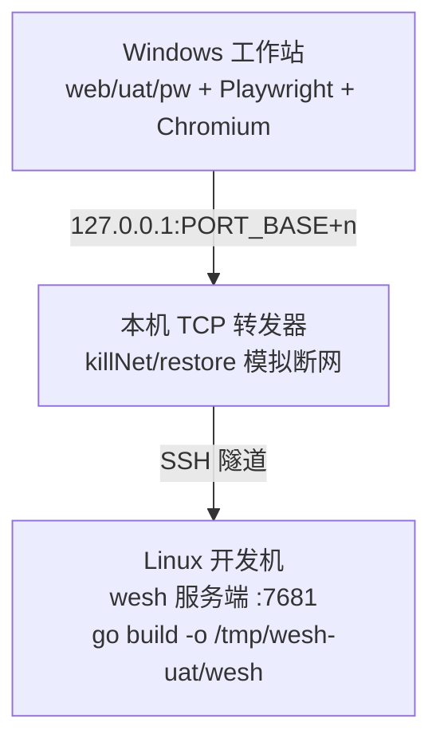

<!-- generated-by: gsd-doc-writer -->

# wesh 测试指南

wesh 的测试体系由三翼组成：**Go 单元测试**（标准库 `testing`，测试文件与源码同目录，覆盖服务端全部逻辑；v1.1 起经 `t.Run("mode=…")` 子测试天然双模式覆盖 shared/per-client 两种进程模型）、**分层 UAT 体系**（`web/uat/` 下的零依赖 Node 脚本，对真实构建产物做端到端断言）与**负载标定测试**（`//go:build load` 标签隔离的重型格，手动运行）。三者互相独立：Go 单测与负载格不需要 Node，UAT 不进入 CI，在本地/双机环境按需执行。

## 测试总体结构

UAT 体系按「离浏览器多近」分五层（同时是项目 CODEBUDDY.md 记录的既定测试策略）：

| 层 | 名称 | 载体 | 依赖 | 运行侧 |
|----|------|------|------|--------|
| 1 | 协议层 | `web/uat/phaseNN.mjs`（phase02–09、11–14；`run-all.mjs` 一键矩阵） | 零依赖，Node ≥ 22 原生 WebSocket/fetch（phase14 另需 `herdr`） | Linux（headless 可） |
| 2 | 终端核心逻辑 | `web/uat/*-t1-width.mjs`、`phase05-dims.mjs` | `@xterm/headless`（纯 JS 无原生依赖） | Linux（headless 可） |
| 3 | 前端 DOM 逻辑 | `web/uat/phaseNN-dom.mjs` | `jsdom` + Node 原生 WebSocket/fetch | Linux（headless 可） |
| 4 | 浏览器实测层 | `web/uat/pw/` | Playwright 驱动真实 Chromium | Windows GUI 工作站（双机） |
| 5 | 平台原生行为 | —（显式豁免，不阻塞） | — | 人工/截图留档 |

分层的核心逻辑：**每层只测它能精确断言的面**——协议层断言字节与帧序；`@xterm/headless` 与浏览器前端走同一 buffer 代码路径，可精确断言宽字符占格与光标位置；jsdom 断言门控/防抖/面板渲染等 DOM 逻辑（无排版引擎，布局用固定桩）；Playwright 层覆盖协议与 jsdom 都够不到的观感面（面板文案逐字、倒计时、标题前缀、清屏重绘）。第 5 层显式豁免：真实 OS 网卡断网时序、浏览器权限弹窗、原生 confirm 框、OS 真实 IME 栈、像素视觉——不列为阻塞项，以 `skipped` + reason 记录并风险接受。

## 测试框架与前置条件

**Go 侧**：标准库 `testing`，无第三方断言/测试框架。风格为表驱动测试（table-driven）+ 外部测试包（`package server_test`）。Fuzz 目标用标准库 `go test -fuzz`。前置：Go ≥ 1.26.3（`go.mod` 钉版）。裸 clone 即可直接 `go test ./...`——仓库提交了 `web/dist/index.html` 构建产物（真实终端页）满足 `go:embed` 编译要求。

**UAT 侧**：无测试框架，各脚本自带轻量 `check()` 断言收集器，输出 `PASS/FAIL` 行与汇总，以退出码 0/1 表达门禁结果。依赖分三个独立包：

| 包 | 安装 | 用途 |
|----|------|------|
| `web/` | `pnpm -C web install` | 前端本体（DOM 层加载其构建产物 `web/dist/index.html`） |
| `web/uat/` | `pnpm -C web/uat install` | 层 2/3 所需：`jsdom`、`@xterm/headless`、`@xterm/addon-unicode11` |
| `web/uat/pw/` | `pnpm -C web/uat/pw install --ignore-workspace` | 层 4 所需：`playwright`（独立包，不挂 web/ workspace） |

注意两点：

- **前端构建必须先行**（修改 `web/src/` 后）：`pnpm -C web build` 产出新的 `dist/index.html`，DOM 层与浏览器实测层断言的才是新代码；构建同时承担 tsc 类型检查。
- **协议层脚本零依赖**：phaseNN.mjs 主线只用 Node ≥ 22 内置能力（原生 `WebSocket`/`fetch`/`net`），不依赖 `web/uat/node_modules`，装不装依赖都能跑；只有 `-dom.mjs` 与 xterm headless 类脚本需要安装。

## 运行测试

### Go 单元测试

```bash
go test ./...                                  # 全量（裸 clone 可直接跑）
go test -race -count=1 ./...                   # CI 同款（竞态检测；需 CGO，勿设 CGO_ENABLED=0）
go vet ./...                                   # 静态检查（CI 门禁）
go test ./internal/server/                     # 单包
go test -run TestEchoPTY ./internal/server/    # 单测试函数
go test -race -run TestKqueueExitZombieRace ./internal/pty/   # darwin-only 测试（Linux 侧被构建标签排除，需 macOS）
go test -run 'TestAttachFlow/mode=per-client' ./internal/server/   # 双模式子测试过滤（v1.1 双跑机械，见下）
go test -tags=load -count=1 -timeout=30m -v ./internal/server/     # 负载标定格（重型，手动跑，不进 CI，见下）
```

按包的覆盖面：

| 包 | 测试文件（与源码同目录） | 覆盖面 |
|----|--------------------------|--------|
| `cmd/wesh` | `main_test.go`、`config_test.go`、`fuzz_test.go` | CLI 解析契约（表驱动锁定全部 flag 语义）、启动校验矩阵、TOML 配置加载（`FuzzDecodeFileConfig`） |
| `internal/server` | 34 个 `*_test.go`（32 个测试文件 + `harness_test.go` 双模式装配机械 + `export_test.go` 导出桥；auth/tickets/handshake/multi/resize/keepalive/throttle/origin/tls/proxy/metrics/health/slowclient/limits/e2e/perclient/exit 等） | WS 握手状态机、一次性 ticket、多客户端扇出与写权限仲裁、resize 防抖、保活/踢出、认证节流、Origin 白名单、反代头处理、可观测性端点、优雅下线、per-client 独立会话全语义；含 216 个 `mode=` 双模式子测试与 `load_test.go` 负载格（build tag 隔离） |
| `internal/pty` | `spawn_test.go`、`io_test.go`、`signal_test.go`、`reap_test.go`、`reap_darwin_test.go` | PTY spawn/读写/信号、进程收割；darwin-only 文件（`//go:build darwin`）承担 kqueue 退出竞态裁决，仅 macOS CI leg 运行 |
| `internal/proto` | `proto_test.go`、`fuzz_test.go` | wesh.v1 帧编解码（`FuzzDecodeHello`/`FuzzDecodeResize`：任意输入不 panic + 维度钳制不变量） |
| `web` | `embed_test.go` | Accept-Encoding gzip 协商解析 |

Fuzz 目标的两种跑法：

```bash
go test -fuzz=FuzzDecodeHello -fuzztime=60s ./internal/proto/      # CI 短跑门（60s）
go test -fuzz=FuzzDecodeFileConfig -fuzztime=60s ./cmd/wesh/
go test ./cmd/wesh/    # 常规模式：已入库种子与崩溃语料（cmd/wesh/testdata/fuzz/）作为普通单测零时长回归
```

### Go 双模式测试机械（v1.1）

服务端有两种进程模型：shared（单会话多客户端扇出）与 per-client（每客户端独立 PTY）。v1.1 起两种模型的测试通过统一装配机械在同一套测试文件内完成，`internal/server/harness_test.go` 提供 mode 参数化装配小族：

- `newTestServer`（二值普通形）、`newTrackedTestServer`（+stderr 同步边）、`newHandleTestServer`（+白盒 srv）、`newSessTestServer`（+PTY 会话集访问器）——首参 `mode` 取 `server.SessionModeShared` / `server.SessionModePerClient`，小族两分支各自直传母本装配函数、零行为改写；未知 mode 一律 `t.Fatalf`（fail-fast）。
- CI 结构零改动：`go test -race -count=1 -v ./...` 单步经 `t.Run("mode=shared"/"mode=per-client")` 子测试天然双模式覆盖，ci.yml 零 diff。全仓现有 **216 个 `mode=` 子测试**，`-race` 全量五包全绿（参考开发机实测约 2m46s，量级随机器浮动）。

每个测试按断言与进程模型的关系三维归类（**否决 `t.Skip`**——严禁用跳过换绿）：

| 维度 | 语义 | 先例 |
|------|------|------|
| mode-agnostic | 两列执行同一断言体，期望值同值双跑 | handshake、metrics 认证闸、basepath、customindex、sharetoken、proxy e2e、limits |
| mode-mapped（断言分叉表） | 真值两模式相反时分叉显式成表，逐列写明期望（shared 列期望值与 v1.0 改造前逐字一致） | exit_test（EXIT 广播：shared=全员同帧 / per-client=EXIT 私有化他端零感知）、multi_test（fanout 真值相反、MaxClients 容量走 spawn-intent 口径） |
| mode-exclusive（显式断言未装配） | per-client 列显式断言「该行为未装配」的可证伪负断言 | multi_test owner 四测——owner 断开/移除不触发任何递补（他端权限/角色零变化、零升格 Welcome 帧），误装配递补即静默窗断言翻红 |

已知 flake：`TestMaxClients503/mode=per-client` 以 `-run` 过滤的非 `-race` 隔离复跑形态存在 pcSessions linger 窗口竞态 flake；全量 `-race`（CI 同款命令）不受影响，修复方向已登记。

### UAT 协议层 / 终端核心 / DOM 层（Linux 侧）

统一约定：先构建二进制到默认路径 `/tmp/wesh-uat/wesh`，再以 `node web/uat/phaseNN.mjs` 运行（大多数脚本接受二进制路径作第一参数覆盖默认值；脚本自行 spawn 真实服务端实例，监听 `127.0.0.1` 随机端口）：

```bash
pnpm -C web build                                  # DOM 层需要最新构建产物
pnpm -C web/uat install                            # DOM/xterm 层依赖（协议层可跳过）
go build -o /tmp/wesh-uat/wesh ./cmd/wesh
node web/uat/phase02.mjs                           # 单跑某个 phase
node web/uat/phase04-dom.mjs /tmp/wesh-uat/wesh    # 显式指定二进制路径
```

载具登记（`web/uat/`）：

| 脚本 | 层 | 覆盖面 |
|------|----|--------|
| `phase02.mjs` | 协议 | ro/rw 基础握手、exit 广播、版本不匹配、Hello 超时、多客户端 |
| `phase03.mjs` | 协议 | 认证/ticket 全流程、爆破节流、Origin 白名单、TLS、安全头 |
| `phase04.mjs` | 协议 | Welcome prefs 形状、`--client-option` 启动校验 |
| `phase05.mjs` | 协议 | 分享链接全链、双客户端一致性、满员 503、1013 慢消费者踢出、递补升格、会话尺寸下发 |
| `phase06.mjs` | 协议 | EXIT 双端广播、信号死亡映射、`--once`、`--exit-when-empty` 两形态、断连重接同一 PTY |
| `phase07.mjs` | 协议 | TOML 配置合并优先级、unix socket 全链、base-path、auth-header 记录与 sanitize |
| `phase08.mjs` | 协议 | `/healthz`、`/metrics` 认证闸与 exposition、审计日志事件 |
| `phase08-journal.mjs` | 协议 | journald 合流流下 jq 示例可用性回归（README 示例逐字一致） |
| `phase09.mjs` | 协议 | `--index` 自定义首页全行为（启动校验/三通道给页/大小上限） |
| `phase11.mjs` | 协议 | per-client 协议面八场景：双端独立 pid 不串台、首帧 winsize=Hello 钳制、运行期删命令 spawn 失败注入、断开 pgid ESRCH 无僵尸、EXIT 私有化、`--max-clients` 容量再闸、断开重连全新进程、trap 免疫 + KILL 兜底 |
| `phase12.mjs` | 协议 | 双模式对照六场景：Welcome.session 模式位、resize 直通双端隔离、ro RESIZE 直通、ro INPUT 丢弃、停读期不丢帧（RawStallClient raw socket 停读夹具）、10s+ dwell 真实等待 → 1013 |
| `phase13.mjs` | 协议 | 防线与终结语义六场景：churn 节流 + XFF 换键、KILL 兜底默认 5s、退出三形态进程级 255、Shutdown N 组双端 1001、metrics 四计数器与零身份 label、`WESH_REMOTE_USER` env 注入链 |
| `phase14.mjs` | 协议（herdr driving） | herdr driving 三通道互证（herdr area 翻转链 / wesh 双 session_start 双 pid / 流层增量关系断言）+ ro 汇聚 share 链接防假绿；依赖 Linux 侧已安装 `herdr`，会话隔离经 `wesh-uat-p14-*` 命名会话 |
| `phase04-t1-width.mjs` | 终端核心 | CJK/emoji 宽字符占格与光标位置（Unicode11 激活） |
| `phase05-dims.mjs` | 终端核心 | 异尺寸双端会话尺寸约束渲染等价锁 |
| `phase04-dom.mjs` | DOM | 门控/防抖/条件注册/prefs 应用/协议帧消费（加载真实 dist bundle） |
| `phase05-dom.mjs` | DOM | ro 三要素门控、递补升格 UX、1013/503/无效链接专版面板 |
| `phase06-dom.mjs` | DOM | 重连状态机逻辑面（1006 自动重连、专版手动面板边界） |
| `phase12-dom.mjs` | DOM | per-client reset 全链（`terminal.reset()` ⊇ clear 判别：alt screen 残影不复活）、ro resize RESIZE 真实上行 + 渲染尺寸 fit 跟随、旧服务端缺 session 键 Welcome 兼容 |
| `phase07-b1b5.sh`、`phase07-b2.mjs`、`phase07-b3.mjs`、`phase07-b6.sh` | 协议（辅助） | socket 并发/EADDRINUSE、多值头、`--cwd`/`--term`/`--stop-timeout`、`--open`×TLS；**二进制路径硬编码为 `/tmp/wesh-uat/wesh`** |
| `phase05-flood-driver.mjs` | （辅助） | 洪水驱动子进程，被 `phase05-dom.mjs` 调用，不单独运行 |
| `minrepro-p14.mjs`（web/uat/）、`pw/minrepro-win.mjs` | （辅助） | Phase 14 执行期「浏览器 tab 首键入后输出流非确定性死亡」的独立最小复现载具（Linux/Windows 各一），调试用，不入矩阵 |

所有脚本输出 `PASS/FAIL` 逐行结果 + 末尾汇总（如 `结果: 12/12 协议断言通过`），失败时退出码非 0，可直接接 shell 循环批量跑。

### 一键矩阵 runner（Linux 侧）

```bash
node web/uat/run-all.mjs                             # 全 17 项；二进制缺席自动 go build（失败打印指引退出 1）
node web/uat/run-all.mjs '' phase11 phase12 phase13  # 过滤子集（用默认二进制时首参占位 ''，防混位守卫拦截脚本名误传）
node web/uat/run-all.mjs /path/to/wesh phase14       # 显式二进制路径 + 过滤
```

矩阵 17 项 = 协议 12（phase02–09、11–13）+ jsdom 4（phase04/05/06/12-dom）+ herdr 1（phase14，含真实等待排末位）。执行纪律：**串行**（脚本间进程清理与端口释放互不干扰）+ 逐脚本 **10min 超时护栏**（SIGTERM 整个进程组、2s 后 SIGKILL 兜底；超时转 FAIL 不阻断后续脚本）。runner 本体零断言零解析——门禁语义归各子脚本既有 exit code 0/1，输出仅加 `[脚本名]` 行前缀（敏感值自净归各子脚本）。退出码：全绿 0 / 任一失败 1 / 用法错误（含未知脚本名防静默跑空）2。pw 层不纳入矩阵（双机拓扑硬约束）——收口闸为人工两段式：Linux runner 全绿 + Windows pw 全绿。

### 浏览器实测层（Windows GUI 侧，双机模型）

层 4 只能在具备 GUI 的机器运行：Playwright 驱动本机真实 Chromium，经本机 TCP 转发器（kill/restore 模拟断网 RST 语义）连接 SSH 可达的 Linux 侧 wesh 服务端。**禁止**在 Windows 侧构建运行 wesh（无 Windows PTY 支持），也**禁止**操作真实网卡模拟断网。



```bash
# Windows 侧（首次）
pnpm -C web/uat/pw install --ignore-workspace
npx playwright install chromium

# 运行（全量约 2 分钟；Linux 侧需 SSH BatchMode 可达且已构建）
WESH_UAT_SSH=user@host WESH_UAT_SSH_PORT=36000 pnpm -C web/uat/pw uat:06
node web/uat/pw/phase06-pw.mjs t1          # 单项调试
```

载具：`phase06-pw.mjs`（断网重连/观感全链六项）、`phase07-a2-pw.mjs` + `phase07-a2-ctl.sh`（真 nginx 反代子路径双机全链）、`phase09-caddy-pw.mjs` + `phase09-caddy-ctl.sh`（Caddy 反代双机全链）、`phase12-pw.mjs`（真实浏览器 resize 观感——jsdom 固定布局桩够不到的真实 fit 链路：放大跟随/缩小回落/回原尺寸无漂移）、`phase14-pw.mjs`（herdr driving 双 tab 观感：移动端 attach 后桌面端面板边框列位置逐字不变；键入/观测走 Node 裸 WS 驱动端，浏览器双 tab 纯被动渲染观测）。运行入口均为 `node web/uat/pw/phaseNN-pw.mjs`（`pnpm -C web/uat/pw uat:06` 为 phase06 的快捷形态）。产物为 `results.json`（结构化结果）与 `screenshots/`（观感留档，gitignore）。环境变量表与断网模拟原理见 `web/uat/pw/README.md`。

### 负载标定测试（`//go:build load`，手动运行）

`internal/server/load_test.go` 整文件挂 `//go:build load` 标签（必须是文件首行），与常规 `go test ./...`、CI 完全隔离——负载格是重型手动通道。标定纪律：**验证为主、证伪才改**——默认验证现值成立（合法慢端零误踢、内存上界成立、信用门开闭频率可接受），数据证伪才改常量默认值（不动 flag 面）；每格产出 `LOADDATA` 行（clients/profile/kicks/gate_transitions/outbox_max/alloc_peak/alloc_base/dur_ms 等键值对），是 README 标定表回填的直接数据源。

```bash
go test -tags=load -count=1 -timeout=30m ./internal/server/ -v
```

| 测试 | 剖面 | 核心断言 |
|------|------|----------|
| `TestLoadFanoutMatrix` | shared 扇出 {1,4,16,32} 端 × seq 洪水（~33.8MB/端，全活跃读） | 全端收流字节数相等 + 流尾末位字段到洪水末尾 + `kicks==0` + 放大比 `ws_sent ≥ N×pty_output` |
| `TestLoadLegitSlowReaderZeroKick` | 滴漏产出 ~205KB/s + 限速 400KB/s 读者 | 全程 `kicks==0`（合法慢端零误踢）+ 快慢端收流逐字节相等（零丢帧） |
| `TestLoadMemoryBound` | 32 端洪水内存剖面 | Alloc 峰值 ≤ 64MiB（4× 账面最坏）+ GC 后回基线 ±50% |
| `TestLoadGateTransitions` | 突发 ~2.2MB/s × 限速 600KB/s 读者 | 信用门转换 ≥2 次且 ≤10 次/s（半水位迟滞不震颤）+ `kicks==0` |
| `TestLoadDefunct` | 200 轮 spawn/teardown 高频建销（Linux-only，/proc 口径） | goroutine/fd 回基线 +4 容差 + 全部曾存子进程零 Z 态 |
| `TestChurnPerClientSpawnThrottle` | 10rps × 30s churn（生产默认节流桶，零覆写） | `throttled>0`（防线生效过）+ `spawn_total==attached` 程序序对照 + gor/mem/fd 差值上界 |
| `TestLoadPerClientFloodMatrix` | per-client {1,4,16,32} 会话各自独立洪水（每客户端各发一次触发 INPUT） | 每端收流一致 + `spawn_total==N` 程序序对照 + `kicks==0` |
| `TestLoadPerClientResident` | per-client sh 零输入驻留（Linux-only，驻留稳定门轮询） | mem ≤ N×(768KiB+ε) / gor ≤ 基线+6N+ε / fd ≤ 基线+4N+ε + 子进程 VmRSS ≤15MB |

## 编写新测试

### Go 单测约定

- 文件与被测源码**同目录**，命名 `*_test.go`；测试包用外部形态（`package server_test`）从公共 API 进攻，`internal/server/export_test.go` 负责把内部符号导出给测试包。
- 风格为**表驱动**：一个 `tests := []struct{...}` 表锁定一个契约面（如 `TestParseArgs` 逐 flag 锁定解析语义），表头用 `t.Setenv` 清空宿主环境隔离（防宿主 `WESH_CREDENTIAL` 污染计数断言）。
- 涉及平台差异的测试加**构建标签**：`//go:build darwin`（先例：`internal/pty/reap_darwin_test.go` 的 kqueue 竞态裁决，CI 由 macos leg 承担）。
- 新增 fuzz 目标：`func FuzzXxx(f *testing.F)`，`f.Add` 至少覆盖合法/负值超大/截断/空载荷/类型混乱五类种子；断言「不 panic + 契约不变量」两条。注意 `-fuzz` 每次只能匹配单包单目标（工具链约束），CI 中每个目标独立一行。
- 新增服务端测试默认走**双模式装配**：先按三维归类（mode-agnostic 同断言双跑 / mode-mapped 分叉表 / mode-exclusive 显式负断言），再经 `harness_test.go` 小族（`newTestServer` 等）以 `t.Run("mode="+mode)` 双跑——禁直连 shared/per-client 各自装配函数新增单模式测试，禁用 `t.Skip` 豁免某一列。分叉表的 shared 列期望值必须与改造前基线逐字一致。

### UAT 脚本约定

- 命名 `phaseNN.mjs`（协议层）/ `phaseNN-dom.mjs`（DOM 层）/ `phaseNN-pw.mjs`（浏览器层）/ `phaseNN-xx.sh`（shell 辅助）；新 phase 直接新建文件，复用既有脚本的基建模式。
- 协议层保持**零依赖**：只用 Node ≥ 22 原生 `WebSocket`/`fetch`/`net`/`child_process.spawn`；spawn 真实二进制（默认 `/tmp/wesh-uat/wesh`，`process.argv[2]` 可覆盖），从 stdout 的 `listening on` 行解析实际端口。
- 断言基建：脚本头部定义 `check(id, name, ok, detail)` 收集结果，末尾打印汇总并以 `process.exit(passed === total ? 0 : 1)` 收口；异步 DOM 变化用条件轮询 `waitFor`（5s 超时），启动/握手都要有 watchdog 超时防挂死。
- **输出红线（全部 UAT 层强制）**：凭据值、share token、ticket 值只作协议构造/断言材料，**永不进入 check detail 或任何控制台输出**——detail 只打状态码/布尔/形状/退出码/文案常量。
- DOM 层：jsdom 加载真实构建产物 `web/dist/index.html`（单文件 IIFE，`window.eval` 执行），注入 Node 原生 `WebSocket`/`fetch` 与**固定布局桩**（终端 720×408 px、字符 9×17 px → 恰 80×24，保证鼠标事件 cell 换算确定）。
- 终端核心层：`@xterm/headless` 必须带 `allowProposedApi: true`，加载 `Unicode11Addon` 并激活 `unicode.activeVersion = '11'`（与 `web/src/main.ts` 生产配置同顺序）。
- 浏览器层：新建 `phaseNN-pw.mjs` 复用 `web/uat/pw/lib/` 四件套——`forwarder.mjs`（TCP 转发器 kill/restore）、`server.mjs`（SSH/启停/退出码捕获）、`browser.mjs`（launch/面板断言/waitTermText 等）、`check.mjs`（Check 断言收集）。
- 新 phase 脚本须同步登记进 `web/uat/run-all.mjs` 的 `SCRIPTS` 矩阵（该矩阵是「零遗漏」的定义基准，辅助脚本不入矩阵）。herdr 类脚本的全部断言与清理只经 `wesh-uat-*` 命名会话 + `HERDR_SOCKET_PATH` 定向（用户日常 default 会话零触达），`finally` 兜底清理——wesh 死后 herdr server 存活是特性，必须显式 stop。

## 覆盖率要求

**无覆盖率阈值配置**——仓库不含任何 coverage 门禁（Go 侧无 `covermode`/阈值参数，JS 侧无 c8/nyc 配置），CI 也不跑覆盖率。质量门禁由以下面承担：`go vet` + `-race` 全量单测、两个 60s fuzz 短跑门、以及 UAT 的逐项 PASS/FAIL 退出码。需要覆盖率数据时手动执行：

```bash
go test -cover ./...
go test -coverprofile=cover.out ./internal/server/ && go tool cover -html=cover.out
```

## CI 集成

CI 定义在 `.github/workflows/ci.yml`，触发条件 `push` + `pull_request`，共三个 job：

| Job | 运行器 | 步骤 | 说明 |
|-----|--------|------|------|
| `go` | ubuntu-latest + macos-latest 矩阵 | `go vet ./...` → `go test -race -count=1 -v ./...` | darwin leg 同时承担 kqueue 运行时裁决（读取单测试 PASS/SKIP 结果，故带 `-v`）；**不设 CGO_ENABLED**（`-race` 需要 cgo）；216 个 `mode=` 双模式子测试经同一单步天然覆盖（ci.yml 对双模式机械零 diff） |
| `web` | ubuntu-latest | `pnpm -C web install --frozen-lockfile` → `pnpm -C web build` | pnpm 11.21.0 + Node 24 显式钉版；build = tsc 类型检查 + vite 构建一体 |
| `fuzz` | ubuntu-latest | `go test -fuzz=FuzzDecodeHello -fuzztime=60s ./internal/proto/`、`go test -fuzz=FuzzDecodeFileConfig -fuzztime=60s ./cmd/wesh/` | 两目标两次独立调用（`-fuzz` 每次只匹配单包单目标）；不加竞态检测器 |

UAT 体系（协议层/DOM 层/浏览器实测层）与负载标定格**均不在 CI 内**：协议层与 DOM 层依赖本机 spawn 真实二进制的时序行为，浏览器层依赖 Windows GUI 工作站与双机 SSH 拓扑，负载格为手动重型通道（build tag 隔离）——均按需在本地执行，以脚本退出码/测试结果作门禁。
